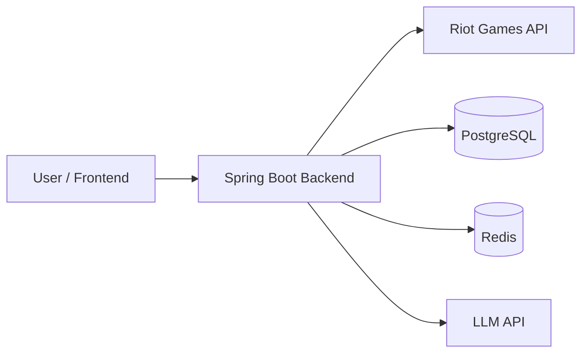

# Architecture

이 문서는 LOL Insight 프로젝트의 **현재 아키텍처 방향을 설명하는 기준 문서**다.

구현 세부사항을 모두 고정하는 설계서가 아니라,
코드가 성장하더라도 유지해야 할 주요 경계와 의존 방향을 기록하는 living document로 사용한다.

아직 구현되지 않은 세부사항은 필요 이상으로 미리 확정하지 않는다.

## 1. Architecture Goals

이 프로젝트의 아키텍처는 다음 목표를 우선한다.

1. Riot Games API와 핵심 비즈니스 로직의 결합을 줄인다.
2. 플레이 데이터의 수집, 정제, 통계 계산, AI 분석 단계를 명확히 분리한다.
3. 외부 API를 실제 호출하지 않고도 핵심 로직을 테스트할 수 있게 한다.
4. 초기에는 단순한 구조로 빠르게 개발하되 이후 기능 확장이 가능해야 한다.
5. 설계 의도와 기술적 trade-off가 코드에서 드러나도록 한다.

## 2. Architecture Style

### Current Choice

초기 아키텍처는 **Modular Monolith**를 사용한다.

하나의 Spring Boot 애플리케이션 안에서 기능별 경계를 나누되,
초기부터 마이크로서비스로 분리하지 않는다.

### Why

현재 단계에서는 다음 이유로 Modular Monolith가 적절하다.

- 배포와 로컬 개발이 단순하다.
- 데이터 정합성을 관리하기 쉽다.
- 기능 간 리팩터링 비용이 낮다.
- 네트워크 통신과 분산 트랜잭션 문제를 만들지 않는다.
- 프로젝트의 핵심 학습 목표인 Backend 설계와 외부 API 연동에 집중할 수 있다.

서비스 규모와 팀 규모가 커져 독립 배포가 실제로 필요해질 때
특정 모듈의 분리를 검토한다.

## 3. System Context



Backend가 서비스의 중심이며 Frontend가 Riot API나 LLM API를 직접 호출하지 않는다.

이를 통해 다음을 Backend에서 통제한다.

- API Key 보호
- Rate Limit 대응
- 캐싱
- 데이터 정규화
- 통계 계산
- 요청 검증
- 오류 처리
- 분석 feature 생성
- LLM 요청 비용 관리

## 4. Main Functional Areas

프로젝트는 현재 다음 기능 영역을 기준으로 성장한다.

### Player

플레이어 식별 및 검색과 관련된 기능을 담당한다.

구체적인 Riot 식별자 처리 방식과 저장 정책은 구현 단계에서 결정한다.

### Match

Match 조회, 필요한 데이터 정규화, 전적/통계 생성과 관련된 기능을 담당한다.

Riot API의 원본 Match DTO와 서비스 내부에서 사용하는 모델을 분리한다.

### Analysis

가공된 Match/통계 데이터를 이용해 분석 feature를 만들고
LLM을 통해 자연어 피드백을 생성한다.

LLM Provider의 요청/응답 형식이 Match나 Player의 핵심 로직에 직접 퍼지지 않도록 한다.

### Community

사용자 계정, 게시글, 댓글 등의 일반적인 웹 서비스 기능을 담당한다.

현재 우선순위는 Riot 데이터 기능과 AI 분석 기능보다 낮으므로
구체적인 내부 구조는 실제 구현 단계에서 결정한다.

## 5. Application Dependency Direction

기본적인 요청 흐름은 다음 형태를 우선한다.

```text
Controller
    -> Application / Service
        -> Repository
        -> External Client
```

예를 들어 Match 조회 흐름은 다음과 같이 구성할 수 있다.

```text
MatchController
    -> MatchService
        -> RiotApiClient
        -> MatchRepository
```

이 구조는 클래스 이름을 강제하기 위한 것이 아니라
**HTTP, 애플리케이션 로직, 영속성, 외부 통신의 책임을 분리하기 위한 방향**이다.

### Controller

담당 책임:

- HTTP 요청 파싱
- 입력 검증 연결
- 인증된 사용자 정보 전달
- Application/Service 호출
- HTTP 응답 변환

Controller에 Riot API 호출이나 복잡한 통계 계산을 직접 작성하지 않는다.

### Application / Service

담당 책임:

- 하나의 유스케이스 실행
- 비즈니스 흐름 조합
- 필요한 Repository/Client 호출
- 트랜잭션 경계 설정
- 도메인 정책 적용

Spring Framework 또는 외부 API의 세부 구현이 핵심 비즈니스 흐름에 과도하게 퍼지지 않도록 한다.

### Repository

담당 책임:

- 데이터 조회/저장
- 영속성 관련 세부 구현

Repository는 외부 HTTP API 접근 계층으로 사용하지 않는다.

### External Client / Adapter

담당 책임:

- Riot Games API 호출
- LLM API 호출
- 외부 요청/응답 DTO
- HTTP 상태 코드와 외부 오류 해석
- Timeout 등 통신 관련 정책

외부 API 변경이 핵심 서비스 로직에 직접 영향을 주는 범위를 줄인다.

## 6. Package Direction

초기에는 **package-by-feature**를 우선한다.

예시는 다음과 같다.

```text
src/main/kotlin/<base-package>/
├── player/
├── match/
├── analysis/
├── community/
└── global/
```

각 기능 내부에서 필요한 경우 다음과 같이 역할을 나눌 수 있다.

```text
match/
├── api/
├── application/
├── domain/
├── persistence/
└── infrastructure/
```

단, 모든 기능에 동일한 하위 패키지를 기계적으로 만들지 않는다.

코드가 몇 개 없는 기능에 불필요한 계층과 인터페이스를 미리 추가하지 않고,
복잡도가 생길 때 자연스럽게 분리한다.

`global/`에는 정말 여러 기능이 공유하는 설정과 횡단 관심사만 둔다.
도메인에 속한 코드를 편의를 위해 `global`로 이동시키지 않는다.

## 7. Riot Games API Boundary

Riot API는 외부 시스템으로 취급한다.

```text
Riot API JSON
    -> Riot API DTO
    -> normalization / mapping
    -> internal model
```

### Principles

- Riot API DTO를 JPA Entity로 직접 사용하지 않는다.
- Riot API DTO가 Controller 응답 모델 전체로 퍼지는 것을 피한다.
- 외부 필드 변경이 내부 모델 전체 변경으로 이어지지 않도록 한다.
- 필요한 데이터만 내부 모델 또는 통계 feature로 변환한다.
- API Key는 환경 설정을 통해 주입하고 저장소에 커밋하지 않는다.

### Current Client Structure

공통 Riot API 통신은 `global/riot`에 둔다. 이 패키지는 여러 기능에서 공유하는
외부 시스템 설정과 HTTP 통신 책임만 가지며, Player나 Match 도메인 로직을 포함하지 않는다.

```text
RiotAccountClient / RiotSummonerClient / RiotLeagueClient / RiotMatchClient
    -> RiotApiHttpClient
        -> RestClient
        -> Riot Games API
```

- `RiotApiProperties`는 `RIOT_API_KEY`와 platform/regional base URL을 설정으로 바인딩한다.
- `RiotApiRouting`은 endpoint가 요구하는 platform 또는 regional host를 명시한다.
- `RiotApiHttpClient`는 모든 Riot 요청에 `X-Riot-Token`을 적용하고, URI 변수와 query parameter를 안전하게 조합한다.
- `RestClient`에는 설정 가능한 connect/read timeout을 적용한다. timeout을 포함한 통신 실패는 `RiotApiTransportException`으로 변환한다.
- Riot의 HTTP 오류는 상태 코드와 응답 본문을 보존하는 외부 API 예외로 변환한다. 서비스의 HTTP 오류 응답으로 변환하는 정책은 실제 API endpoint를 추가할 때 결정한다.

현재는 blocking Spring MVC 구조에 맞춰 Spring `RestClient`를 사용한다. endpoint별 Client는
필요해지는 시점에 해당 기능 패키지의 infrastructure 경계에 추가하고,
공통 전송기에는 endpoint DTO나 도메인 판단을 넣지 않는다.

### Recent Match Detail Fan-Out

최근 경기 조회는 Account-V1 Riot ID 조회와 Match-V5 Match ID 목록 조회를 요청 thread에서 순차로
수행한다. 그 뒤의 Match Detail 조회만 `recentMatchDetailExecutor`로 fan-out 한다. 이 executor는
Spring application lifecycle이 관리하는 고정 4-thread pool이며, 서비스도 한 요청에서 최대 4개의
Detail 작업만 제출하는 sliding window를 사용한다.

작업 완료 순서는 응답 순서가 아니다. 각 Detail 결과는 원래 Match ID 목록의 index에 저장한 뒤 index
순서로 response를 조립하므로 API 사용자는 Riot Match ID 목록의 순서를 그대로 받는다.

이 4는 동시에 실행 중인 Match Detail HTTP 호출 수의 상한이다. token bucket이나 요청/초 제한기는
아니며, process-wide cooldown도 제공하지 않는다. 429를 포함해 전체 요청을 실패시켜야 하는 Detail
오류를 수집하면 아직 제출하지 않은 작업은 더 제출하지 않고, 이미 제출됐지만 실행 전인 작업은
`cancel(false)`로 취소한다. 실행 중인 blocking HTTP 호출은 강제로 interrupt하거나 취소하지 않는다.
Match Detail 404와 target PUUID가 없는 Detail만 unavailable 결과로 수집하여 partial response를 만든다.

### Error Boundary

Riot HTTP 오류는 공통 `RiotApiHttpClient`에서 status code와 response body를 보존하는
`RiotApiResponseException`으로 변환한다. 429 응답에서는 `Retry-After` header의 유효한
정수 초 값만 `retryAfterSeconds`로 추가 보존하며, 원본 response header 전체를 외부 계층에
전달하지 않는다.

endpoint의 의미가 필요한 404는 endpoint별 Client가 feature의 내부 예외로 변환한다.

- `RiotAccountClient`의 Account-V1 404는 `PlayerNotFoundException`으로 변환한다.
- `RiotMatchClient.findMatchById`의 Match-V5 Detail 404는 `MatchNotFoundException`으로 변환한다.
- Match ID 목록 조회 등 다른 endpoint의 404는 일반 Riot HTTP 오류로 유지한다.

`GlobalExceptionHandler`는 Riot endpoint나 원본 response body를 해석하지 않는다. 내부의
not-found 예외는 404로, Riot 429는 유효한 경우에만 `Retry-After` header를 포함한 429로,
인증/권한 및 5xx를 포함한 기타 Riot HTTP 오류와 빈/잘못된 응답은 502로 변환한다.
connect/read timeout 등의 transport failure는 503으로 변환한다. 자동 retry와 process-wide
rate-limit cooldown은 이 경계에 포함하지 않으며 별도 정책으로 결정한다.

### Operational Concerns

Riot API 호출에서는 다음 상황을 고려한다.

- Rate Limit
- Timeout
- 일시적인 5xx
- 인증/권한 오류
- 존재하지 않는 리소스
- API 변경

재시도와 캐시는 실제 API 특성과 데이터 신선도 요구사항을 확인한 뒤 적용한다.

## 8. Match Data Processing

원본 Match 응답은 매우 크기 때문에
LLM이나 API 응답에서 항상 전체 원본 데이터를 그대로 사용하지 않는다.

기본 데이터 처리 흐름은 다음과 같다.

```text
Riot Match DTO
    -> normalization
    -> selected match data
    -> statistics / derived metrics
    -> API response or analysis feature
```

The Player recent-Matches and player statistics endpoints share an application-level loader for
`Riot ID -> PUUID -> Match IDs -> domain Match` orchestration. The loader preserves the bounded
Detail fan-out and partial-result policy; each endpoint maps the resulting normalized Match list to
its own response. Statistics calculation is a separate application component and does not call
Riot or Redis directly.

원본 데이터를 DB에 얼마나 저장할지,
정규화된 데이터를 저장할지,
필요할 때 Riot API에서 다시 가져올지는
데이터 사용 패턴과 Rate Limit을 확인하며 별도 결정한다.

이 결정이 서비스 전체의 저장 비용과 데이터 모델에 큰 영향을 주게 되면 ADR로 기록한다.

## 9. AI Analysis Architecture

AI 기능의 기본 원칙은 **계산과 설명을 분리하는 것**이다.

```text
Riot API data
    -> Backend normalization
    -> Backend statistics calculation
    -> Analysis feature generation
    -> LLM request
    -> Natural-language feedback
```

### Backend Responsibility

가능하면 Backend에서 다음을 결정적으로 계산한다.

- KDA 등 기본 수치
- 분당/비율 기반 통계
- 비교값
- 집계값
- 분석 기준에 필요한 파생 feature
- LLM에게 전달할 구조화된 입력

### LLM Responsibility

LLM은 주로 다음 역할을 담당한다.

- 구조화된 수치 해석
- 중요한 패턴 설명
- 사용자에게 이해하기 쉬운 피드백 생성
- 개선 포인트의 자연어 표현

LLM이 정확한 산술 계산이나 원본 Match JSON의 전체 구조 이해를 담당한다고 가정하지 않는다.

### Provider Boundary

OpenAI API 등 특정 Provider의 SDK나 응답 타입이
Analysis 핵심 모델 전체로 전파되지 않도록 Client/Adapter 경계를 둔다.

Provider 교체 가능성을 이유로 과도한 추상화를 미리 만들지는 않지만,
최소한 외부 SDK 타입과 핵심 애플리케이션 로직은 분리한다.

## 10. Persistence

기본 영속 저장소는 PostgreSQL을 사용한다.

JPA/Hibernate를 우선 사용하되,
조회 성능이나 쿼리 표현력이 실제 문제가 되는 부분에서는
JPQL, QueryDSL, native query 등 다른 접근을 검토할 수 있다.

Entity를 Controller의 API 응답으로 직접 반환하지 않는다.

DB schema와 Entity 변경은 migration 전략이 도입되면 함께 관리한다.

구체적인 테이블과 관계는 기능 구현에 따라 별도 설계한다.

## 11. Cache

Redis는 **필요성이 확인된 데이터에 선택적으로 도입**한다.

초기부터 모든 조회에 Redis를 사용하지 않는다.

적용 후보는 다음과 같다.

- Riot API 호출 비용이 큰 데이터
- 짧은 시간에 반복 조회되는 데이터
- 일정 시간 동안 동일해도 되는 통계 결과

캐시를 추가할 때는 최소한 다음을 결정한다.

- cache key
- TTL
- cache miss 동작
- 데이터 신선도 허용 범위
- 장애 시 fallback 여부

복잡한 캐시 무효화가 필요한 데이터는
캐시 자체가 적절한지 먼저 검토한다.

### Match Detail Cache

`RiotMatchClient.findMatchById` is cached through the Spring Cache abstraction. The application
service remains unaware of Redis; both the single Match endpoint and the recent-Matches detail
fan-out reach the same client method and therefore use the same cache path.

- Cache name: `match:detail`
- Redis key: `match:detail:{matchId}`
- Cache value: the internal `Match` domain model, serialized as JSON with the Spring Boot
  `ObjectMapper`
- TTL: seven days from a successful write
- Stored values: only successfully mapped Match Detail results; null values are disabled

The Redis cache manager predefines this cache only. It does not create caches for account lookup,
Match ID lists, complete player responses, complete recent-Matches responses, or upstream errors.
`MatchNotFoundException`, Riot 429/5xx responses, transport failures, and invalid or empty upstream
responses leave no cache entry because the cached method does not complete successfully.

Cache hits bypass Match-V5 Detail HTTP calls. Cache misses still call Riot and can still receive a
429 response; caching is not a distributed rate limiter, cooldown, retry, or token-bucket policy.

## 12. Error Handling

오류는 최소한 다음 범주를 구분할 수 있어야 한다.

```text
Client Error
External API Error
Business Error
Infrastructure Error
```

외부 API의 HTTP 상태 코드를 그대로 사용자 API의 상태 코드로 복사하지 않는다.

Riot API 오류를 서비스 관점의 오류로 변환한 뒤
일관된 API 오류 응답 정책을 적용한다.

구체적인 Error Response schema는 API 구현 단계에서 결정한다.

## 13. Security

초기부터 다음 원칙을 지킨다.

- Riot API Key를 Git에 저장하지 않는다.
- LLM API Key를 Git에 저장하지 않는다.
- 로그에 비밀값을 남기지 않는다.
- Frontend에 서버용 API Key를 전달하지 않는다.
- 사용자 입력을 외부 API 호출 파라미터로 사용할 때 검증한다.

사용자 계정 기능이 추가되면 Spring Security 기반의 인증/인가 구조를 별도로 설계한다.

인증 방식은 아직 확정하지 않는다.

## 14. Observability

운영 단계에서는 최소한 다음을 관찰할 수 있어야 한다.

- 외부 API 호출 성공/실패
- 외부 API latency
- Rate Limit 관련 실패
- 주요 Endpoint latency
- 캐시 hit/miss
- LLM 호출 실패
- LLM 사용량 및 비용 추적에 필요한 지표

구체적인 로깅/메트릭 스택은 배포 구조를 정할 때 결정한다.

## 15. MVP vs Future

### MVP

우선순위:

- 단일 Spring Boot Backend
- Riot API 연동
- 플레이어/Match 조회
- 필요한 통계 계산
- 기본 DB 저장
- 명확한 오류 처리
- 핵심 테스트
- 필요성이 확인된 범위의 캐시
- 구조화된 feature 기반 AI 분석

### Future Considerations

실제 필요가 생겼을 때 검토한다.

- 비동기 Job 처리
- 메시지 큐
- 분석 결과 사전 계산
- 대규모 Match 데이터 파이프라인
- Read Model 분리
- 검색 엔진
- 서비스 모듈 분리 또는 마이크로서비스
- 다중 LLM Provider 전략

미래 가능성만으로 MVP 구조를 복잡하게 만들지 않는다.

## 16. Architecture Change Policy

기존 아키텍처보다 더 적절한 구조가 발견될 수 있다.

그 경우 기존 문서를 맹목적으로 따르는 것이 아니라 다음 절차를 따른다.

1. 현재 구조의 문제를 설명한다.
2. 변경 대안을 검토한다.
3. 필요한 구조 변경을 구현한다.
4. `docs/architecture.md`를 실제 코드 상태에 맞게 수정한다.
5. 장기간 영향을 주는 중요한 선택이라면 ADR을 추가한다.

Architecture 문서는 코드보다 앞서 미래 구조를 선언하는 문서가 아니라,
**현재 코드베이스의 주요 설계 방향을 신뢰할 수 있게 설명하는 문서**여야 한다.
