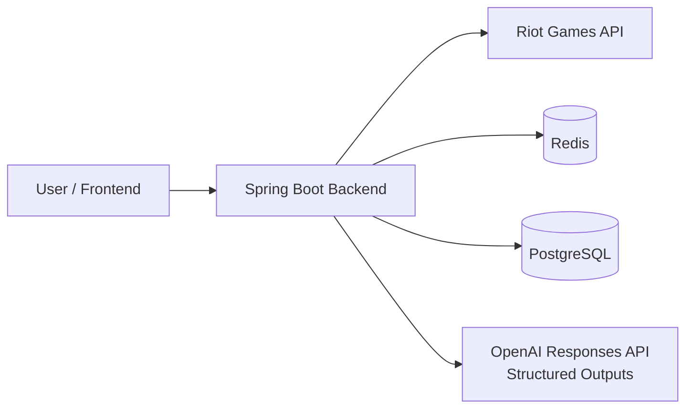

# Architecture

이 문서는 LOL Insight 프로젝트의 **현재 아키텍처 방향을 설명하는 기준 문서**다.

구현 세부사항을 모두 고정하는 설계서가 아니라,
코드가 성장하더라도 유지해야 할 주요 경계와 의존 방향을 기록하는 living document로 사용한다.

아직 구현되지 않은 세부사항은 필요 이상으로 미리 확정하지 않는다.

## 1. Architecture Goals

이 프로젝트의 아키텍처는 다음 목표를 우선한다.

1. Riot Games API와 핵심 비즈니스 로직의 결합을 줄인다.
2. 플레이 데이터의 수집, 정제, 통계 계산, AI 분석 단계를 명확히 분리한다.
3. 외부 API를 실제 호출하지 않고도 핵심 로직을 테스트할 수 있게 한다.
4. 초기에는 단순한 구조로 빠르게 개발하되 이후 기능 확장이 가능해야 한다.
5. 설계 의도와 기술적 trade-off가 코드에서 드러나도록 한다.

## 2. Architecture Style

### Current Choice

초기 아키텍처는 **Modular Monolith**를 사용한다.

하나의 Spring Boot 애플리케이션 안에서 기능별 경계를 나누되,
초기부터 마이크로서비스로 분리하지 않는다.

### Why

현재 단계에서는 다음 이유로 Modular Monolith가 적절하다.

- 배포와 로컬 개발이 단순하다.
- 데이터 정합성을 관리하기 쉽다.
- 기능 간 리팩터링 비용이 낮다.
- 네트워크 통신과 분산 트랜잭션 문제를 만들지 않는다.
- 프로젝트의 핵심 학습 목표인 Backend 설계와 외부 API 연동에 집중할 수 있다.

서비스 규모와 팀 규모가 커져 독립 배포가 실제로 필요해질 때
특정 모듈의 분리를 검토한다.

## 3. System Context



Backend가 서비스의 중심이며 Frontend가 Riot API나 향후 LLM API를 직접 호출하지 않는다.

현재 구현은 Riot Games API, Redis Match Detail cache, `BenchmarkSample`용 PostgreSQL/JPA/Flyway
persistence 및 OpenAI Responses API Structured Outputs 분석 경계를 사용한다. OpenAI API key가 없는 상태에서도
애플리케이션은 시작하며, 분석 endpoint를 실제 호출할 때만 명시적인 configuration error를 반환한다.

이를 통해 다음을 Backend에서 통제한다.

- API Key 보호
- Rate Limit 대응
- 캐싱
- 데이터 정규화
- 통계 계산
- 요청 검증
- 오류 처리
- 분석 feature 생성
- LLM 요청 비용 관리

## 4. Main Functional Areas

프로젝트는 현재 다음 기능 영역을 기준으로 성장한다.

### Player

플레이어 식별 및 검색과 관련된 기능을 담당한다.

현재 Account-V1 기반 Riot ID 조회와 최근 Match 조회·통계 계산이 구현되어 있다. 저장 정책은 아직 결정하거나
구현하지 않았다.

### Match

Match 조회, 필요한 데이터 정규화, 전적/통계 생성과 관련된 기능을 담당한다.

Riot API의 원본 Match DTO와 서비스 내부에서 사용하는 모델을 분리한다.

### Analysis

가공된 Match/통계 데이터를 이용해 분석 feature를 만든다. 현재는 개인 요약용 `PlayerAnalysisFeature`, peer
comparison의 사용자 측 입력인 `PlayerComparisonContext`, 그리고 exact cohort benchmark와 결합한
`PlayerComparisonFeature`가 구현되어 있다. `PlayerComparisonFeature`는 현재 Ranked Solo rank와 대상 사용자의
`(championId, position)`별 통계를 기준으로 benchmark availability와 numeric difference를 결정한다.
`PlayerAnalysisService`는 AVAILABLE comparison이 하나라도 있을 때만 `PlayerAnalysisGenerator`를 정확히 한 번 호출해
`PlayerAnalysisResult`를 만든다. OpenAI prompt와 SDK DTO는 infrastructure에만 둔다.

LLM Provider의 요청/응답 형식이 Match나 Player의 핵심 로직에 직접 퍼지지 않도록 한다.

### Benchmark

Peer Benchmark는 샘플링한 ranked player의 Ranked Solo Match participant 관측치를 수집하고, cohort별로
집계해 상대 비교에 사용하는 기능 영역이다. KR `RANKED_SOLO_5x5`의 League-V4 entry를 page 단위로 읽고
entry가 제공하는 PUUID를 사용하는 ranked player discovery, `SampledRankedPlayer` domain model, `BenchmarkSample`
domain/entity, Flyway schema 및 idempotent persistence 진입점은 구현됐다. collector는 Match-V5의 `queue=420` Match ID
filter와 Detail 검증을 함께 사용하고, Match ID deduplication·sampled player 관계 보존·participant metric 계산·sample
저장까지 수행한다. raw `benchmark_sample`을 PostgreSQL에서 on-demand 집계하는 `PeerBenchmarkQueryService`와
match-level percentile threshold, 이를 사용자 context와 결합하는 `PlayerComparisonFeature`는 구현됐다. scheduler,
player percentile rank는 아직 구현되지 않았고, LLM integration은 ADR-007의 범위에서 구현됐다. 확정된 데이터 모델 원칙은
[ADR-006](adr/006-use-sampled-peer-benchmark.md)을 따른다.

### Community

사용자 계정, 게시글, 댓글 등의 일반적인 웹 서비스 기능을 담당한다.

현재 우선순위는 Riot 데이터 기능과 AI 분석 기능보다 낮으므로
구체적인 내부 구조는 실제 구현 단계에서 결정한다.

## 5. Application Dependency Direction

기본적인 요청 흐름은 다음 형태를 우선한다.

```text
Controller
    -> Application / Service
        -> Repository
        -> External Client
```

예를 들어 Match 조회 흐름은 다음과 같이 구성할 수 있다.

```text
MatchController
    -> MatchService
        -> RiotApiClient
        -> MatchRepository
```

이 구조는 클래스 이름을 강제하기 위한 것이 아니라
**HTTP, 애플리케이션 로직, 영속성, 외부 통신의 책임을 분리하기 위한 방향**이다.

### Controller

담당 책임:

- HTTP 요청 파싱
- 입력 검증 연결
- 인증된 사용자 정보 전달
- Application/Service 호출
- HTTP 응답 변환

Controller에 Riot API 호출이나 복잡한 통계 계산을 직접 작성하지 않는다.

### Application / Service

담당 책임:

- 하나의 유스케이스 실행
- 비즈니스 흐름 조합
- 필요한 Repository/Client 호출
- 트랜잭션 경계 설정
- 도메인 정책 적용

Spring Framework 또는 외부 API의 세부 구현이 핵심 비즈니스 흐름에 과도하게 퍼지지 않도록 한다.

### Repository

담당 책임:

- 데이터 조회/저장
- 영속성 관련 세부 구현

Repository는 외부 HTTP API 접근 계층으로 사용하지 않는다.

### External Client / Adapter

담당 책임:

- Riot Games API 호출
- LLM API 호출
- 외부 요청/응답 DTO
- HTTP 상태 코드와 외부 오류 해석
- Timeout 등 통신 관련 정책

외부 API 변경이 핵심 서비스 로직에 직접 영향을 주는 범위를 줄인다.

## 6. Package Direction

초기에는 **package-by-feature**를 우선한다.

예시는 다음과 같다.

```text
src/main/kotlin/<base-package>/
├── player/
├── match/
├── analysis/
├── community/
└── global/
```

각 기능 내부에서 필요한 경우 다음과 같이 역할을 나눌 수 있다.

```text
match/
├── api/
├── application/
├── domain/
├── persistence/
└── infrastructure/
```

단, 모든 기능에 동일한 하위 패키지를 기계적으로 만들지 않는다.

코드가 몇 개 없는 기능에 불필요한 계층과 인터페이스를 미리 추가하지 않고,
복잡도가 생길 때 자연스럽게 분리한다.

`global/`에는 정말 여러 기능이 공유하는 설정과 횡단 관심사만 둔다.
도메인에 속한 코드를 편의를 위해 `global`로 이동시키지 않는다.

## 7. Riot Games API Boundary

Riot API는 외부 시스템으로 취급한다.

```text
Riot API JSON
    -> Riot API DTO
    -> normalization / mapping
    -> internal model
```

### Principles

- Riot API DTO를 JPA Entity로 직접 사용하지 않는다.
- Riot API DTO가 Controller 응답 모델 전체로 퍼지는 것을 피한다.
- 외부 필드 변경이 내부 모델 전체 변경으로 이어지지 않도록 한다.
- 필요한 데이터만 내부 모델 또는 통계 feature로 변환한다.
- API Key는 환경 설정을 통해 주입하고 저장소에 커밋하지 않는다.

### Current Client Structure

공통 Riot API 통신은 `global/riot`에 둔다. 이 패키지는 여러 기능에서 공유하는
외부 시스템 설정과 HTTP 통신 책임만 가지며, Player나 Match 도메인 로직을 포함하지 않는다.

```text
RiotAccountClient / RiotMatchClient
    -> RiotApiHttpClient
        -> RestClient
        -> Riot Games API
```

- `RiotApiProperties`는 `RIOT_API_KEY`와 platform/regional base URL을 설정으로 바인딩한다.
- `RiotApiRouting`은 endpoint가 요구하는 platform 또는 regional host를 명시한다.
- `RiotApiHttpClient`는 모든 Riot 요청에 `X-Riot-Token`을 적용하고, URI 변수와 query parameter를 안전하게 조합한다.
- `RestClient`에는 설정 가능한 connect/read timeout을 적용한다. timeout을 포함한 통신 실패는 `RiotApiTransportException`으로 변환한다.
- Riot의 HTTP 오류는 상태 코드와 응답 본문을 보존하는 외부 API 예외로 변환한다. 서비스의 HTTP 오류 응답으로 변환하는 정책은 실제 API endpoint를 추가할 때 결정한다.

현재는 blocking Spring MVC 구조에 맞춰 Spring `RestClient`를 사용한다. 구현된 endpoint별 Client는
Account-V1의 `RiotAccountClient`, Match-V5의 `RiotMatchClient`, 그리고 League-V4의 `RiotLeagueClient`다.
`RiotLeagueClient`는 League response DTO를 infrastructure 안에 가두고, ladder entry의 PUUID를
`SampledRankedPlayer`로 정규화한다. 또한 PUUID 기반 entries 응답에서는 `RANKED_SOLO_5x5` entry만 선택해
`PlayerRankLookupService`가 사용하는 rank 입력으로 매핑한다. PUUID rank lookup과 tier/division ladder discovery는
서로 다른 application service로 유지한다. 공통 전송기에는 endpoint DTO나 도메인 판단을 넣지 않는다.

### Bounded Match Detail Batch Loading

`MatchDetailBatchLoader`는 최근 경기와 benchmark collector가 함께 사용하는 Match Detail fan-out 경계다. 최근
경기 조회는 Account-V1 Riot ID 조회와 Match-V5 Match ID 목록 조회를 요청 thread에서 순차로 수행하고, 그 뒤의
Detail만 이 loader로 전달한다. executor는 Spring application lifecycle이 관리하는 고정 4-thread pool이며, loader는
한 batch에서 최대 4개의 Detail 작업만 제출하는 sliding window를 사용한다.

작업 완료 순서는 응답 순서가 아니다. 각 Detail 결과는 원래 Match ID 목록의 index에 저장한 뒤 index
순서로 response를 조립하므로 API 사용자는 Riot Match ID 목록의 순서를 그대로 받는다.

이 4는 동시에 실행 중인 Match Detail HTTP 호출 수의 상한이다. token bucket이나 요청/초 제한기는
아니며, process-wide cooldown도 제공하지 않는다. Player flow는 429·5xx·transport failure에서 이후 제출을 멈추고
기존 오류를 전파한다. collector는 404·5xx·transport failure를 Match별 partial failure로 집계하지만 429에서는
이후 제출을 멈추고 `cancel(false)`로 실행 전 작업을 취소하며 Retry-After를 결과에 보존한다. 실행 중인 blocking
HTTP 호출은 강제로 interrupt하거나 취소하지 않는다.

### Error Boundary

Riot HTTP 오류는 공통 `RiotApiHttpClient`에서 status code와 response body를 보존하는
`RiotApiResponseException`으로 변환한다. 429 응답에서는 `Retry-After` header의 유효한
정수 초 값만 `retryAfterSeconds`로 추가 보존하며, 원본 response header 전체를 외부 계층에
전달하지 않는다.

endpoint의 의미가 필요한 404는 endpoint별 Client가 feature의 내부 예외로 변환한다.

- `RiotAccountClient`의 Account-V1 404는 `PlayerNotFoundException`으로 변환한다.
- `RiotMatchClient.findMatchById`의 Match-V5 Detail 404는 `MatchNotFoundException`으로 변환한다.
- Match ID 목록 조회 등 다른 endpoint의 404는 일반 Riot HTTP 오류로 유지한다.

`GlobalExceptionHandler`는 Riot endpoint나 원본 response body를 해석하지 않는다. 내부의
not-found 예외는 404로, Riot 429는 유효한 경우에만 `Retry-After` header를 포함한 429로,
인증/권한 및 5xx를 포함한 기타 Riot HTTP 오류와 빈/잘못된 응답은 502로 변환한다.
connect/read timeout 등의 transport failure는 503으로 변환한다. 자동 retry와 process-wide
rate-limit cooldown은 이 경계에 포함하지 않으며 별도 정책으로 결정한다.

### Operational Concerns

Riot API 호출에서는 다음 상황을 고려한다.

- Rate Limit
- Timeout
- 일시적인 5xx
- 인증/권한 오류
- 존재하지 않는 리소스
- API 변경

재시도와 캐시는 실제 API 특성과 데이터 신선도 요구사항을 확인한 뒤 적용한다.

## 8. Match Data Processing

원본 Match 응답은 매우 크기 때문에
LLM이나 API 응답에서 항상 전체 원본 데이터를 그대로 사용하지 않는다.

기본 데이터 처리 흐름은 다음과 같다.

```text
Riot Match DTO
    -> normalization
    -> selected match data
    -> statistics / derived metrics
    -> API response or analysis feature
```

The Player recent-Matches and player statistics endpoints share an application-level loader for
`Riot ID -> PUUID -> Match IDs -> domain Match` orchestration. The loader preserves the bounded
Detail fan-out and partial-result policy; each endpoint maps the resulting normalized Match list to
its own response. Statistics calculation is a separate application component and does not call
Riot or Redis directly.

원본 데이터를 DB에 얼마나 저장할지,
정규화된 데이터를 저장할지,
필요할 때 Riot API에서 다시 가져올지는
데이터 사용 패턴과 Rate Limit을 확인하며 별도 결정한다.

이 결정이 서비스 전체의 저장 비용과 데이터 모델에 큰 영향을 주게 되면 ADR로 기록한다.

### Peer Benchmark Flow

현재의 플레이어 흐름과 향후 benchmark 흐름은 목적과 집계 단위가 다르므로 독립적으로 존재한다.

```text
Player flow (implemented)
Riot API
    -> normalized Match
    -> PlayerMatchStatistics
    -> PlayerAnalysisFeature
    -> PlayerComparisonContext (current Solo rank + champion/position user metrics)

Benchmark flow (collection and aggregation implemented)
ranked player source
    -> sampled players (implemented)
    -> recent Ranked Solo Match IDs (implemented)
    -> Match ID deduplication (implemented)
    -> normalized Match (implemented)
    -> BenchmarkSample (implemented)
    -> saveIfAbsent persistence (implemented)
    -> Benchmark Aggregate (implemented)
    -> PeerBenchmark (implemented)
    -> PlayerComparisonFeature (implemented)
```

`PlayerComparisonContext`는 `PlayerAnalysisFeature`와 별개의 comparison-ready 사용자 입력이다. 대상 PUUID와
PUUID로 조회한 현재 `RANKED_SOLO_5x5` tier/division 및 그 조회 시각을 담고, rank가 없으면 `rankContext = null`로
정상 표현한다. 대상 사용자의 Match 표본은 `(championId, position)`별로 분리하고,
`MatchParticipantMetricsCalculator`의 KDA, CS/min, gold/min, damage/min, vision/min, kill participation,
damage share 공식을 재사용한다. 이 단계는 `PeerBenchmarkQueryService`를 호출하지 않는다.

`PlayerComparisonFeatureService`는 `PlayerComparisonContextService`와 `PeerBenchmarkQueryService`를 조합한다.
rank가 있으면 KR Ranked Solo의 `region / queueId / tier / division / position / championId` exact cohort만 만들고,
`findBenchmarkExcludingPlayer`로 대상 사용자의 own `BenchmarkSample`을 PostgreSQL aggregate에서 제외한다. 이
excluded aggregate로 각 cohort의 사용자 표본·benchmark availability를 판정한 뒤 `AVAILABLE`일 때만 7개 metric의
numeric difference를 계산한다. rank가 없으면 query 없이 `UNRANKED` comparison을 만든다.
`PlayerAnalysisService`는 이 feature의 AVAILABLE 항목만 OpenAI adapter로 전달하고, 다른 status는 최소 요약만
전달한다. PUUID는 aggregate exclusion에만 사용하며 OpenAI input으로 전달하지 않는다. player percentile rank는
계획 상태다. 상세 contract와 statistical limit은 [Player Comparison Feature v0.1](ai/player-comparison-feature-v0.1.md)을
따른다.

#### BenchmarkSample

`BenchmarkSample` 한 건은 여러 경기 평균이 아니라 `(sampled player PUUID, matchId)`로 식별되는 한 경기의
participant-level observation이다. 즉 sampled player가 해당 Ranked Solo Match에서 기록한 KDA, CS/min,
gold/min, damage/min, vision/min, kill participation, damage share 등의 per-match metric이 한 sample을 이룬다.

여러 sample의 average, median, percentile은 별도의 aggregate 단계에서 계산한다. per-match metric의 source of
truth는 `MatchParticipantMetricsCalculator`이며 Player statistics와 collector가 함께 사용한다. aggregate 객체를
`BenchmarkSample`으로 재사용하지 않는다.

`BenchmarkSample` persistence는 `benchmark_sample` table에 `matchId`, `puuid`, cohort context, participant
context와 per-match metric을 저장한다. `championName`은 display용 중복 데이터이므로 저장하지 않고 안정적인
`championId`만 사용한다. tier, division, position은 ordinal이 아닌 문자열로 보존한다. `rankCapturedAt`,
`gameStartTimestamp`, `collectedAt`은 각각 rank 확인 시각, 실제 Match 시작 시각, 우리 시스템의 저장 시각이며
서로 대체하지 않는다. 별도 rank history가 필요해지면 `RankSnapshot` 같은 모델은 향후 정책과 함께 결정한다.

#### Tier Attribution and Cohort

League API로 rank를 확인해 sampled player A가 GOLD I인 경우, A의 participant만 GOLD I `BenchmarkSample`을
만든다. A와 같은 Match에 있었다는 사실만으로 다른 9명에게 GOLD I을 부여하거나 tier를 추정하지 않는다. 다른
participant B의 rank가 별도로 확인돼 B도 sampled player라면, B의 sample은 B의 관측 rank로 별도 생성할 수 있다.

MVP의 rank는 일반적으로 **수집 시점의 rank**다. 이를 과거 Match 시점의 정확한 rank라고 가정하지 않는다.
따라서 "현재 GOLD인 sampled player의 최근 Ranked Solo Match"라는 시간 해석을 명시한다.

`PeerBenchmark` v0.1 cohort dimension은 region, queue, tier, division, position, championId다. division을 포함해
GOLD I sample을 전체 GOLD benchmark로 해석하지 않는다. 서로 다른 position을 같은 기준선으로 직접 비교하지 않는다.
patch/gameVersion과 freshness window는 아직 cohort에 포함하지 않는다.

#### Match-level PeerBenchmark Aggregate

`PeerBenchmarkQueryService.findBenchmark(cohort)`는 raw `benchmark_sample`의 전체 exact cohort를 PostgreSQL에서
on-demand로 읽는다. Player comparison은 별도의
`findBenchmarkExcludingPlayer(cohort, targetPuuid)`를 사용한다. `BenchmarkSampleAggregateRepository`가
`COUNT(*)`, `COUNT(DISTINCT puuid)`, `AVG`와 `percentile_cont`를 실행하며, exclusion query는 같은 SQL predicate에
`puuid <> :excludedPuuid`를 추가해 모든 aggregate statistic에서 target의 own sample을 제외한다. JPA Entity를
application layer에 반환하지 않는다. `PeerBenchmark`는 KDA, CS/min, gold/min, damage/min, vision/min, kill
participation, damage share 각각의 mean, median, p25, p75, p90 threshold를 보유한다.

이는 cohort의 **match-level observation distribution**이다. p90은 sample metric의 90th percentile threshold이지
플레이어의 상위 10%나 사용자 percentile rank가 아니다. 한 sampled player가 여러 유효 Match를 제공하면 여러
observation으로 분포에 기여하므로 `sampleCount`와 `uniquePlayerCount`를 분리한다. availability는 0건의 `NO_DATA`,
휴리스틱(기본 30 samples 및 10 unique players) 미달의 `INSUFFICIENT_SAMPLE`, 그 외 `AVAILABLE`로 구분한다. Player
comparison에서는 own sample exclusion 후의 count로 availability를 다시 평가한다.

v0.1은 aggregate table, materialized view, Redis aggregate cache 없이 correctness를 먼저 검증한다. `gameVersion`과
`gameStartTimestamp`는 저장하지만 patch-aware cohort나 retention policy는 아직 없다. 따라서 오래된 sample이 누적되면
patch mixing이 발생할 수 있고 production 도입 전 freshness window 또는 patch-aware cohort 전략이 필요하다.

#### Initial Vertical Slice

`tier=GOLD`, `division=I`, `playerLimit=10` discovery는 League-V4 page 조회와 entry PUUID 사용을 검증하는 작은 vertical
slice다. 이 단계의 `SampledRankedPlayer`는 수집 시점의 rank context만 담고 persistence하지 않는다. 이후
`matchesPerPlayer=5` 같은 Match 수집·sample persistence 흐름은 별도 단계다. 이를 GOLD 전체 population의 대표 평균이나
production-quality benchmark로 표현하지 않는다. 여러 division/page와 sampling policy는 실제 benchmark 품질을 높이는
별도 결정이다.

### 제한된 개발용 Benchmark Seed

Benchmark module은 개발 전용 opt-in manual seed test도 제공한다. 이는 제한된 League-V4 page 범위와 player 및
match 예산을 받아 KR `RANKED_SOLO_5x5` / queue 420으로 수집 범위를 고정하고, 중복을 제거한
`SampledRankedPlayer` 목록을 기존 `BenchmarkMatchCollectionService`에 전달한다. public endpoint,
`ApplicationRunner`, scheduler, Spring Batch job, retry loop, sleep, rate limiter 또는 schema 변경은 추가하지 않는다.

`RankedPlayerDiscoveryService.discoverPaged`는 요청한 1-based page를 순서대로 조회하고 최초의 빈 page에서
중단한다. 각 page의 PUUID를 정렬하고 그 결정적인 순서에서 처음 나타난 PUUID만 유지한다. player 예산은 unique
player에 적용한다. 기존 non-paged discovery method는 기존 호출자를 위해 유지한다. discovery와 collection 모두
manual seed에서 Riot 429를 terminal condition으로 처리한다. 이후 discovery page 또는 새로운 collection 요청을
시작하지 않으며, 유효한 `Retry-After` 초 값은 `BenchmarkSeedResult`에 포함하고 응답 전에 저장된 sample은 유지한다.

`BenchmarkCohortCoverageQueryService`는 comparison query가 아닌 내부 개발용 read model이다. repository는 필수
region/queue/tier/division scope에서 PostgreSQL `GROUP BY region, queue_id, tier, division, position, champion_id`와
`COUNT(*)`, `COUNT(DISTINCT puuid)`를 사용한다. corpus를 JVM으로 읽거나 metric distribution을 다시 계산하지 않는다.
service는 `BenchmarkAvailabilityPolicy`를 재사용하고, 남은 sample 및 unique-player 수를 AVAILABLE 상태, unique player
수, sample 수, position, champion ID 순으로 정렬해 반환한다.

coverage는 제외할 target player 없이 전체 exact-cohort corpus를 기준으로 계산한다. 따라서 선택한 analysis target에
대해 `findBenchmarkExcludingPlayer(cohort, targetPuuid)`가 부족한 상태여도 coverage는 AVAILABLE일 수 있다.
comparison flow는 반드시 exclusion 결과를 다시 확인해야 한다. 제한된 seed와 coverage report는 convenience sampling
pipeline만 검증하며 corpus의 대표성이나 운영 준비 상태를 보장하지 않는다.

## 9. AI Analysis Architecture

AI 기능의 기본 원칙은 **계산과 설명을 분리하는 것**이다.

```text
Riot API data
    -> Backend normalization
    -> Backend statistics calculation
    -> Peer Benchmark comparison
    -> Analysis / comparison feature generation
    -> AVAILABLE comparison gate
    -> OpenAI Responses API Structured Outputs
    -> Natural-language feedback
```

### Backend Responsibility

가능하면 Backend에서 다음을 결정적으로 계산한다.

- KDA 등 기본 수치
- 분당/비율 기반 통계
- 비교값
- 집계값
- 분석 기준에 필요한 파생 feature
- LLM에게 전달할 구조화된 입력
- cohort 선택과 sample size 검증
- average, median, match-level percentile threshold 및 player와 benchmark의 numeric difference 계산

### LLM Responsibility

LLM은 주로 다음 역할을 담당한다.

- 구조화된 수치 해석
- 중요한 패턴 설명
- 사용자에게 이해하기 쉬운 피드백 생성
- 개선 포인트의 자연어 표현

LLM이 정확한 산술 계산이나 원본 Match JSON의 전체 구조 이해를 담당한다고 가정하지 않는다.
LLM은 cohort를 선택하거나 sample availability·subtraction·player percentile을 계산하거나 임의 benchmark·MMR을
만들지 않는다. `PlayerComparisonFeature`가 LLM에 전달할 구조화된 comparison input의 source of truth다.

### Provider Boundary

OpenAI API 등 특정 Provider의 SDK나 응답 타입이
Analysis 핵심 모델 전체로 전파되지 않도록 Client/Adapter 경계를 둔다.

Provider 교체 가능성을 이유로 과도한 추상화를 미리 만들지는 않지만,
최소한 외부 SDK 타입과 핵심 애플리케이션 로직은 분리한다.

### Implemented v0.1 LLM Analysis

`POST /api/v1/players/{gameName}/{tagLine}/analysis`는 기존 `PlayerComparisonFeatureService`를 그대로 사용한다.
rank가 없으면 `UNRANKED`, AVAILABLE comparison이 없으면 `INSUFFICIENT_COMPARISON_DATA`를 반환하며, 두 경우 모두
provider를 호출하지 않는다. AVAILABLE comparison이 있으면 `PlayerAnalysisGenerator`를 정확히 한 번 호출한다.

입력은 exact cohort, 사용자 경기 수, benchmark sample/unique player 수, Backend가 계산한 7개 metric의 값·평균·중앙값·
percentile threshold·difference뿐이다. PUUID, Riot ID, Match ID, raw Riot JSON, DB/Redis 데이터, API key와 raw provider
error는 제외한다. v0.1은 OpenAI Responses API Structured Outputs를 사용하되, OpenAI SDK와 schema DTO는
`analysis/infrastructure/openai`에만 두고 application 결과로 즉시 변환한다.

Prompt는 모든 사용자 노출 문장을 한국어로 제한하며, player percentile/top X%, player-level aggregate, 보편적인
good/bad·지표 방향성, cross-position/champion ranking, LLM의 표본 적격성 판단, patch/freshness/timeline 추론을 금지한다.
결과 cache, DB persistence, retry/backoff 및 비용 관측은 v0.1 범위 밖이다. 상세 contract는
[Player Analysis v0.1](ai/player-analysis-v0.1.md), 결정 근거는 [ADR-007](adr/007-use-structured-llm-analysis-boundary.md)을 따른다.

## 10. Persistence

PostgreSQL, JPA/Hibernate, Flyway는 `BenchmarkSample` persistence에 도입됐다. schema source of truth는
Flyway migration이며, JPA는 `ddl-auto=validate`로 mapping만 검증한다. datasource의 production credentials는
`POSTGRES_HOST`, `POSTGRES_PORT`, `POSTGRES_DB`, `POSTGRES_USER`, `POSTGRES_PASSWORD` 환경변수로 제공한다.
`local` profile에만 Compose와 일치하는 개발 기본값이 있다. Redis는 여전히 Match Detail cache로만 사용한다.

`BenchmarkSample`은 analytics/application에서 의미 있는 domain model이고 `BenchmarkSampleEntity`는 PostgreSQL
표현이다. Entity를 Controller 응답이나 향후 aggregate model로 직접 반환하지 않는다. `(match_id, puuid)` unique
constraint가 데이터 정합성의 최종 방어선이며, `BenchmarkSamplePersistenceService.saveIfAbsent`는 짧은
transaction 안에서 PostgreSQL `INSERT ... ON CONFLICT DO NOTHING`을 실행한다. duplicate는 기존 row를 갱신하지
않고 `ALREADY_EXISTS`로 처리한다. collector는 Riot HTTP 호출과 sample 생성을 transaction 밖에서 마친 뒤 이
진입점을 호출하므로 일부 upstream 실패가 이미 저장한 sample을 rollback하지 않는다.

aggregate query는 raw table의 PostgreSQL `AVG`와 `percentile_cont`로 on-demand 실행한다. 현재 dataset 규모와
사용 패턴에서는 aggregate table, materialized view, Redis aggregate cache 및 추가 cohort index를 도입하지 않았다.
저장 기간, freshness window, patch-aware cohort와 aggregate materialization은 실제 query latency 및 사용 패턴을
측정한 뒤 별도 결정한다.

이 persistence는 PostgreSQL Testcontainers `@DataJpaTest`로 migration, JPA mapping validation, round trip,
unique constraint와 idempotent write를 검증한다. 별도 aggregate fixture test는 exact cohort isolation,
`COUNT(*)`/`COUNT(DISTINCT puuid)`, mean, median, p25, p75, p90과 availability를 검증한다. 따라서 해당 integration
test에는 Docker daemon이 필요하다.
기존 Riot/Redis Spring context test는 datasource auto-configuration을 test scope에서만 제외하고 persistence
repository mock을 주입해 실제 PostgreSQL 없이도 기존 검증 범위를 유지한다.

## 11. Cache

Redis는 **필요성이 확인된 데이터에 선택적으로 도입**한다.

초기부터 모든 조회에 Redis를 사용하지 않는다.

적용 후보는 다음과 같다.

- Riot API 호출 비용이 큰 데이터
- 짧은 시간에 반복 조회되는 데이터
- 일정 시간 동안 동일해도 되는 통계 결과

캐시를 추가할 때는 최소한 다음을 결정한다.

- cache key
- TTL
- cache miss 동작
- 데이터 신선도 허용 범위
- 장애 시 fallback 여부

복잡한 캐시 무효화가 필요한 데이터는
캐시 자체가 적절한지 먼저 검토한다.

### Match Detail Cache

`RiotMatchClient.findMatchById` is cached through the Spring Cache abstraction. The application
service remains unaware of Redis; both the single Match endpoint and the recent-Matches detail
fan-out reach the same client method and therefore use the same cache path.

- Cache name: `match:detail`
- Redis key: `match:detail:{matchId}`
- Cache value: the internal `Match` domain model, serialized as JSON with the Spring Boot
  `ObjectMapper`
- TTL: seven days from a successful write
- Stored values: only successfully mapped Match Detail results; null values are disabled

The Redis cache manager predefines this cache only. It does not create caches for account lookup,
Match ID lists, complete player responses, complete recent-Matches responses, or upstream errors.
`MatchNotFoundException`, Riot 429/5xx responses, transport failures, and invalid or empty upstream
responses leave no cache entry because the cached method does not complete successfully.

Cache hits bypass Match-V5 Detail HTTP calls. Cache misses still call Riot and can still receive a
429 response; caching is not a distributed rate limiter, cooldown, retry, or token-bucket policy.

benchmark collection은 기존 `RiotMatchClient.findMatchById`를 호출해 이 Match Detail cache 경로를 재사용한다.
이 결정은 benchmark 전용 Redis cache, collector state cache 또는 aggregate cache를 새로 도입하는 것이 아니다.

## 12. Error Handling

오류는 최소한 다음 범주를 구분할 수 있어야 한다.

```text
Client Error
External API Error
Business Error
Infrastructure Error
```

외부 API의 HTTP 상태 코드를 그대로 사용자 API의 상태 코드로 복사하지 않는다.

Riot API 오류를 서비스 관점의 오류로 변환한 뒤
일관된 API 오류 응답 정책을 적용한다.

구체적인 Error Response schema는 API 구현 단계에서 결정한다.

## 13. Security

초기부터 다음 원칙을 지킨다.

- Riot API Key를 Git에 저장하지 않는다.
- LLM API Key를 Git에 저장하지 않는다.
- 로그에 비밀값을 남기지 않는다.
- Frontend에 서버용 API Key를 전달하지 않는다.
- 사용자 입력을 외부 API 호출 파라미터로 사용할 때 검증한다.

사용자 계정 기능이 추가되면 Spring Security 기반의 인증/인가 구조를 별도로 설계한다.

인증 방식은 아직 확정하지 않는다.

## 14. Observability

운영 단계에서는 최소한 다음을 관찰할 수 있어야 한다.

- 외부 API 호출 성공/실패
- 외부 API latency
- Rate Limit 관련 실패
- 주요 Endpoint latency
- 캐시 hit/miss
- LLM 호출 실패
- LLM 사용량 및 비용 추적에 필요한 지표

구체적인 로깅/메트릭 스택은 배포 구조를 정할 때 결정한다.

## 15. MVP vs Future

### MVP

현재 구현:

- 단일 Spring Boot Backend
- Account-V1, Match-V5, League-V4 Riot API 연동
- 플레이어/Match 조회와 normalized Match 생성
- 최근 Match 기반 통계 계산과 `PlayerAnalysisFeature` 생성
- 현재 Solo rank와 champion/position별 사용자 지표를 담는 `PlayerComparisonContext` 생성
- exact benchmark availability와 numeric difference를 담는 `PlayerComparisonFeature` 생성
- 명확한 오류 처리
- 핵심 테스트
- Match Detail Redis cache와 bounded detail fan-out

다음 우선순위:

- representative sampling과 scheduled benchmark collection
- player percentile rank
- player percentile rank

### Future Considerations

실제 필요가 생겼을 때 검토한다.

- 비동기 Job 처리
- scheduled benchmark collection
- 메시지 큐
- 분석 결과 사전 계산
- 대규모 Match 데이터 파이프라인
- rank snapshot, larger/stratified sampling, patch-aware benchmark
- Read Model 분리
- 검색 엔진
- 서비스 모듈 분리 또는 마이크로서비스
- 다중 LLM Provider 전략

미래 가능성만으로 MVP 구조를 복잡하게 만들지 않는다.

## 16. Architecture Change Policy

기존 아키텍처보다 더 적절한 구조가 발견될 수 있다.

그 경우 기존 문서를 맹목적으로 따르는 것이 아니라 다음 절차를 따른다.

1. 현재 구조의 문제를 설명한다.
2. 변경 대안을 검토한다.
3. 필요한 구조 변경을 구현한다.
4. `docs/architecture.md`를 실제 코드 상태에 맞게 수정한다.
5. 장기간 영향을 주는 중요한 선택이라면 ADR을 추가한다.

Architecture 문서는 코드보다 앞서 미래 구조를 선언하는 문서가 아니라,
**현재 코드베이스의 주요 설계 방향을 신뢰할 수 있게 설명하는 문서**여야 한다.
