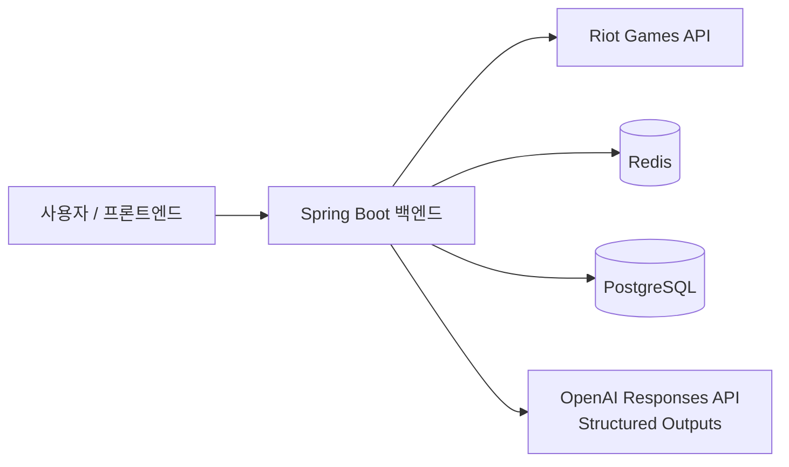

# 아키텍처

이 문서는 LOL Insight 프로젝트의 **현재 아키텍처 방향을 설명하는 기준 문서**다.

구현 세부사항을 모두 고정하는 설계서가 아니라,
코드가 성장하더라도 유지해야 할 주요 경계와 의존 방향을 기록하는 living document로 사용한다.

아직 구현되지 않은 세부사항은 필요 이상으로 미리 확정하지 않는다.

이 문서에서 **현재 구현**은 code와 현재 contract 문서로 검증된 동작만 뜻한다. Tool-using Agent v0.1과 새 Ranked Solo
Match 기반 Automation v0.1은 구현된 현재 기능이며, RAG / Vector Search, deployment 확장처럼 아직 구현되지 않은 항목은
미래 방향과 경계로만 기록하며, 현재 제공 기능처럼
표현하지 않는다. 새 Ranked Solo Match 기반 Automation v0.1은 구현된 현재 기능이며, 이후 Automation 확장은 별도
요구가 확인될 때만 추가한다.

## 1. 아키텍처 목표

이 프로젝트의 아키텍처는 다음 목표를 우선한다.

1. Riot Games API와 핵심 비즈니스 로직의 결합을 줄인다.
2. 플레이 데이터의 수집, 정제, 통계 계산, AI 분석 단계를 명확히 분리한다.
3. 외부 API를 실제 호출하지 않고도 핵심 로직을 테스트할 수 있게 한다.
4. 초기에는 단순한 구조로 빠르게 개발하되 이후 기능 확장이 가능해야 한다.
5. 설계 의도와 기술적 trade-off가 코드에서 드러나도록 한다.

## 2. 아키텍처 스타일

### 현재 선택

초기 아키텍처는 **Modular Monolith**를 사용한다.

하나의 Spring Boot 애플리케이션 안에서 기능별 경계를 나누되,
초기부터 마이크로서비스로 분리하지 않는다.

### 이유

현재 단계에서는 다음 이유로 Modular Monolith가 적절하다.

- 배포와 로컬 개발이 단순하다.
- 데이터 정합성을 관리하기 쉽다.
- 기능 간 리팩터링 비용이 낮다.
- 네트워크 통신과 분산 트랜잭션 문제를 만들지 않는다.
- 프로젝트의 핵심 학습 목표인 Backend 설계와 외부 API 연동에 집중할 수 있다.

서비스 규모와 팀 규모가 커져 독립 배포가 실제로 필요해질 때
특정 모듈의 분리를 검토한다.

## 3. 시스템 컨텍스트



Backend가 서비스의 중심이며 Frontend가 Riot API나 향후 LLM API를 직접 호출하지 않는다.

현재 구현은 Riot Games API, Redis Match Detail·completed analysis result cache, `BenchmarkSample`과 `AnalysisJob`용
PostgreSQL/JPA/Flyway persistence 및 OpenAI Responses API Structured Outputs 분석 경계를 사용한다. OpenAI API key가 없는 상태에서도
애플리케이션은 시작하며, 분석 endpoint를 실제 호출할 때만 명시적인 configuration error를 반환한다.

이를 통해 다음을 Backend에서 통제한다.

- API Key 보호
- Rate Limit 대응
- 캐싱
- 데이터 정규화
- 통계 계산
- 요청 검증
- 오류 처리
- 분석 feature 생성
- LLM 요청 비용 관리

### 현재 구현 흐름

플레이어 분석의 현재 data flow는 다음과 같다.

```text
Riot API
    -> normalization
    -> deterministic statistics
    -> peer benchmark
    -> comparison feature
    -> PlayerAnalysisInput
    -> completed-result cache
    -> OpenAI Structured Output
    -> PlayerAnalysisResult
    -> sync response 또는 async job polling
```

`POST /analysis`는 이 pipeline을 동기로 반환한다. `POST /analysis-jobs`는 `AnalysisJob` lifecycle을 저장하고 bounded
worker에서 같은 `PlayerAnalysisService`를 실행한 뒤 polling으로 결과를 전달한다. 이 service는 effective
`PlayerAnalysisInput`을 SHA-256 fingerprint로 만든 Redis completed-result cache를 조회한 뒤 miss일 때만 OpenAI를 호출한다.
async POST는 generation rate limit을 먼저 적용하고 같은 client·같은 exact request의 `PENDING`/`RUNNING` job만 in-flight
dedupe한다. terminal `AnalysisJob`은 계속 재사용하지 않는다.

## 4. 주요 기능 영역

프로젝트는 현재 다음 기능 영역을 기준으로 성장한다.

### Player

플레이어 식별 및 검색과 관련된 기능을 담당한다.

현재 Account-V1 기반 Riot ID 조회와 최근 Match 조회·통계 계산이 구현되어 있다. 일반 전적·통계 조회는 queue를 지정하지
않은 최근 전체 Match 목록을 사용한다. 저장 정책은 아직 결정하거나 구현하지 않았다.

### Match

Match 조회, 필요한 데이터 정규화, 전적/통계 생성과 관련된 기능을 담당한다.

Riot API의 원본 Match DTO와 서비스 내부에서 사용하는 모델을 분리한다.

### Analysis

가공된 Match/통계 데이터를 이용해 분석 feature를 만든다. 현재는 개인 요약용 `PlayerAnalysisFeature`, peer
comparison의 사용자 측 입력인 `PlayerComparisonContext`, 그리고 exact cohort benchmark와 결합한
`PlayerComparisonFeature`가 구현되어 있다. comparison의 사용자 Match 입력은 Match-V5에 `queue=RankedSoloQueue.ID`를
전달해 최근 Ranked Solo Match ID 목록에서만 읽으며, `start`와 `count`는 이 목록의 pagination이다. Detail 응답도 context
builder에서 같은 queue ID를 방어적으로 확인한 뒤에만 position 및 `(championId, position)` 통계에 포함한다.
`PlayerComparisonFeature`는 현재 Ranked Solo rank와 이 사용자 통계를 각각 같은 scope benchmark와 연결해 availability와
numeric difference를 결정한다.
`PlayerAnalysisService`는 AVAILABLE comparison이 하나라도 있을 때만 `PlayerAnalysisGenerator`를 정확히 한 번 호출해
`PlayerAnalysisResult`를 만든다. OpenAI prompt와 SDK DTO는 infrastructure에만 둔다.

LLM Provider의 요청/응답 형식이 Match나 Player의 핵심 로직에 직접 퍼지지 않도록 한다.

### OpenAI 관측성 v0.1

OpenAI usage와 지연 시간은 OpenAI infrastructure 어댑터 내부에만 둔다. application 경계는
`PlayerAnalysisGenerator -> PlayerAnalysisResult`를 유지하며, application model과 REST response에는
provider usage, provider request identifier, raw provider type을 전달하지 않는다.

어댑터는 provider `openai`의 low-cardinality Micrometer metrics로 요청 결과, provider 호출 지연 시간,
SDK 제공 input/output/total 토큰 카운터와 optional output detail의 reasoning 토큰 카운터를 기록한다.
output detail이 없으면 analysis와 기존 세 counter는 유지하고 reasoning counter만 생략한다. 성공한 호출은
response의 실제 model을 사용하고, 실패한 호출은 실제 model을 받을 수 없을 때만 configured model을 사용한다. tag는
`provider`, `model`, `outcome`, `error_category`, `token_type`으로 제한한다. player, Riot, champion,
match, request identifier는 tag로 사용하지 않는다.

provider 호출 지연 시간은 `responses.create(...)` 직전에 시작해 구조화 response 매핑 또는 해당 exception이
발생한 시점에 끝난다. optional SDK `usage()`가 없어도 analysis는 실패하지 않으며 토큰 카운터만 생략한다.
configuration 실패는 count하지만 OpenAI를 호출하지 않으므로 provider duration은 없다. 기존
exception-to-HTTP mapping은 바꾸지 않는다.

recorder는 best-effort 방식의 프로세스 내부 component다. 어댑터 경계에서 recorder exception을 무시하며
분석의 critical path에 외부 monitoring 요청을 추가하지 않는다. 이 프로젝트에는 이미 Actuator와 Micrometer가
포함되어 있다. exporter, endpoint 노출, Prometheus/Grafana, cost/currency 계산은 별도 운영 결정으로 남긴다.
전체 endpoint 지연 시간은 generator가 아닌 기존 framework HTTP metric으로 측정한다.

이 계측은 prompt, request JSON, response body, analysis 본문, Riot identifier, OpenAI request ID, API key,
raw provider usage object을 log하거나 persist하지 않는다.

### OpenAI generation 기본 정책

production OpenAI 요청은 `reasoning.effort=low`와 `text.verbosity=low`를 명시적으로 전송한다.
`OPENAI_REASONING_EFFORT`(`minimal`·`low`·`medium`·`high`)와
`OPENAI_TEXT_VERBOSITY`(`low`·`medium`·`high`)는 환경별 override 경로로 유지하며, 빈 값 또는 지원하지 않는 값은
기존 configuration error로 처리한다. 이 값은 OpenAI infrastructure 설정에만 있고 application 결과나 REST contract로
전파되지 않는다.

이 정책은 model, prompt, Structured Output schema, `max_output_tokens`, timeout(`60s`), retry(`maxRetries(0)`),
metric name/tag contract를 바꾸지 않는다. representative `/analysis` 단일 표본에서 provider latency 48.7%, endpoint
latency 46.4%, total token 44.4% 감소와 quality contract 유지를 확인했다. 다만 약 40초의 endpoint 지연 시간은
synchronous UX에 여전히 길며, 이를 위해 async analysis job을 별도 실행 경계로 도입했다.

### Async Player Analysis Job v0.1

기존 동기 `POST /api/v1/players/{gameName}/{tagLine}/analysis`는 유지한다. 새로운
`POST /api/v1/players/{gameName}/{tagLine}/analysis-jobs`는 `analysis_job` lifecycle row를 commit한 후
in-memory command를 bounded Spring executor에 제출하고 `202 Accepted` 및 polling Location을 반환한다.
`GET /api/v1/analysis-jobs/{jobId}`는 `PENDING`, `RUNNING`, `SUCCEEDED`, `FAILED`와 terminal result 또는 safe
failure code를 조회한다.

async POST에는 same-process in-flight dedupe가 있다. HTTP boundary에서 기존 `AnalysisRateLimitKeyResolver`로 얻은
client identity와 validation을 통과한 exact `gameName`, `tagLine`, `start`, `count`, `analysis-v0.2` contract version을
SHA-256 digest key로 만든다. 같은 client·같은 request의 `PENDING`/`RUNNING` job만 재사용하며, 다른 client는 job ID를
공유하지 않는다. `SUCCEEDED`/`FAILED` job은 재사용하지 않으므로 다음 요청은 새 job을 만든다. completed-result cache는
worker 내부의 shared `PlayerAnalysisService` 경계에서만 적용된다. sync `/analysis`는 response contract를 유지하기 위해
in-flight dedupe 대상이 아니다.

Caffeine registry는 key별 atomic mapping으로 DB PENDING commit 뒤 job을 연결하고 그 다음 dispatch한다. hit마다 DB
lifecycle을 확인해 terminal entry를 제거하며, worker의 terminal transition도 matching entry를 즉시 제거한다. cleanup
실패를 위한 `expireAfterWrite(5m)` safety expiration은 OpenAI timeout 60초와 기본 worker 1개/queue 2개 lifecycle보다
길다. registry는 DB에 persistence하지 않고 raw Riot ID/client identity를 log·DB·metric tag에 남기지 않는다. process
restart와 multi-instance 사이에는 공유되지 않는다.

worker는 conditional `PENDING -> RUNNING` update로 중복 실행을 막은 뒤, DB transaction 밖에서 기존
`PlayerAnalysisService`를 호출한다. 성공 snapshot은 provider-independent `PlayerAnalysisResult` JSONB만 저장하며,
OpenAI SDK type, raw provider response/prompt, token usage, Riot identifier는 저장하지 않는다. lifecycle 전이와
result/failure 저장은 각각 짧은 transaction이다.

기본 executor는 worker 1개, queue capacity 2개이며 `ANALYSIS_JOB_WORKER_THREADS`,
`ANALYSIS_JOB_QUEUE_CAPACITY`로 조정한다. queue rejection은 PENDING row를
`FAILED(CAPACITY_EXCEEDED)` audit row로 전이시키고 POST에 503을 반환한다. async worker는 기존
OpenAI adapter를 재사용하므로 `ai.generation.*` metrics를 따로 복제하지 않으며 timeout 60초와 retry 0도 바꾸지
않는다.

이 MVP는 same-process command를 사용하므로 process crash recovery, stale-job recovery, automatic retry, persistent
queue, ownership authorization이 없다. UUID는 보안 boundary가 아니다. 자세한 contract와 JSONB schema evolution
제한은 [Async Player Analysis Job v0.1](ai/async-player-analysis-jobs-v0.1.md), 결정 근거는
[ADR-009](adr/009-introduce-asynchronous-player-analysis-jobs.md)를 따른다.

### Analysis generation rate limit v0.1

비용이 발생하는 분석 생성을 보호하기 위해 sync `POST /api/v1/players/{gameName}/{tagLine}/analysis`와 async
`POST /api/v1/players/{gameName}/{tagLine}/analysis-jobs`는 동일한
`analysis-generation:{clientKey}` logical bucket을 소비한다. `GET /api/v1/analysis-jobs/{jobId}` polling은 OpenAI
generation을 발생시키지 않으므로 이 quota의 대상이 아니다.

현재 인증이 없으므로 `AnalysisRateLimitKeyResolver`가 Servlet의 `remoteAddr`를 client key로 바꾼다. Controller는
HTTP request를 resolver에만 전달하고 limiter/application flow에는 HTTP 객체가 전파되지 않는다. 임의의
`X-Forwarded-For`는 신뢰하지 않는다. AWS ALB 또는 reverse proxy 배포 시에는 trusted proxy와 Spring
forward-header strategy를 배포 설정으로 명시한 뒤 resolver가 보는 remote address의 의미를 별도로 검증해야 한다.

기본 정책은 `ANALYSIS_RATE_LIMIT_CAPACITY=3`, `ANALYSIS_RATE_LIMIT_WINDOW=1m`이다. Bucket4j local token bucket은
3개 token을 즉시 허용하고 1분 뒤 interval refill한다. 이는 provider throughput의 최적값이 아니라 worker 1개와
queue 2개로 구성된 현재 async executor에 맞춘 비용 보호 heuristic이다. 허용된 요청은 limiter를 통과한 즉시 quota를
소비하며 Riot/OpenAI 실패, provider 429 또는 async executor의 dispatch rejection에 대해 자동으로 반환하지 않는다.
실패를 반복해 외부 API를 호출하는 우회를 막고 reservation/refund 상태를 추가하지 않기 위함이다.

limiter는 두 POST에서 `PlayerAnalysisService` 호출 또는 `AnalysisJob` row 생성·dispatch보다 먼저 실행한다. quota
초과는 safe ProblemDetail code `ANALYSIS_RATE_LIMIT_EXCEEDED`, HTTP `429 Too Many Requests`, 실제 다음 token 시각을
올림한 `Retry-After` 초 header로 응답한다. 반면 executor queue 용량 초과는 기존처럼 `503 Service Unavailable`과
`CAPACITY_EXCEEDED` audit row를 사용한다. rate limit은 client의 요청 빈도를, executor capacity는 서버가 동시에
수용할 수 있는 작업 수를 각각 보호하므로 서로 대체하지 않는다.

async POST의 순서는 rate limit 후 dedupe다. 따라서 duplicate POST도 quota를 소비하지만, dedupe hit은 새 DB row,
executor slot, Riot/OpenAI 호출을 만들지 않는다. 기존 rate-limit-before-row/dispatch invariant를 보존하는 single-instance
MVP 선택이며, quota를 실제 generation에만 연결하는 reservation/refund protocol은 도입하지 않는다.

현재 Bucket4j local bucket state는 process memory에만 있고 Caffeine `expireAfterAccess(window)`와 library scheduler가
유휴 client bucket을 정리한다. v0.1에는 별도 rate-limit metric을 추가하지 않는다. client IP는 cache key로만 사용하며
log, DB, response, metric tag에 기록하지 않는다. 이 선택은 single-instance MVP에만 정확하다. 인스턴스가 여러 개면
각 인스턴스의 quota가 별도로 존재하므로 전역 per-client 제한이 아니다. 인증 도입 후 resolver의 client key를 `userId`로
교체할 수 있으며, multi-instance 배포 전에는 Redis의 atomic distributed limiter, API Gateway 또는 WAF 중 하나를 별도
운영 결정으로 도입해야 한다. 근거와 대안은
[ADR-010](adr/010-use-in-memory-analysis-generation-rate-limit.md)을 따른다.

### Completed analysis result cache v0.1

`PlayerAnalysisService`는 `PlayerAnalysisInput -> PlayerAnalysisGenerator` 사이에서 Redis completed-result cache를
조회한다. input은 deterministic comparison/metric/limitation order와 Spring Boot `ObjectMapper` JSON을 사용해 canonical
representation으로 만들고, SHA-256 digest만 Redis key에 사용한다. key는
`analysis:result:{version}:{fingerprint}`이며 Riot ID, PUUID, Match ID, raw input을 넣지 않는다.

cache hit은 provider-independent `PlayerAnalysisResult`를 즉시 반환하므로 OpenAI SDK call, retry 및
`ai.generation.*` metric을 만들지 않는다. miss에서만 generator를 호출하고 성공한 result만 typed JSON으로
`ANALYSIS_RESULT_CACHE_TTL`(기본 30분) 동안 저장한다. `ANALYSIS_RESULT_CACHE_VERSION`의 기본값은
`analysis-result-v3`이며 prompt semantics, output schema, analysis contract, generation policy 또는 AI 입력 의미가 바뀌면
명시적으로 bump한다. Ranked Solo 전용 comparison 입력을 도입하며 v1에서 v2로 올렸고, peer 유효기간 정책을 input에 포함하며
v3로 올렸다. 기존 v1/v2 key는 삭제하거나 덮어쓰지 않고 TTL에 따라 자연 만료된다. query의 `asOf`/window boundary는 input에
넣지 않지만 LLM 설명에 필요한 `maxSampleAge` 정책은 provider-independent input에 포함한다. freshness의 일차 기준은 TTL이
아니라 input fingerprint이므로 latest Riot/rank/benchmark 계산 결과가 input을 바꾸면 miss가 발생한다.

Redis read/write, corrupted value cleanup, fingerprint 생성, cache metric 기록은 fail-open이다. read failure와 corrupted
value는 miss로, write failure는 저장 생략으로 처리하고 analysis result를 바꾸지 않는다. corrupted JSON은 가능하면
삭제하며 raw content를 log하지 않는다. success-only cache이므로 timeout, provider rate limit, malformed response와
exception에는 negative entry를 남기지 않는다. `analysis.result.cache.requests`에는 `outcome=hit|miss`만 tag로 기록한다.

sync와 async worker는 같은 service boundary를 공유하지만, async POST는 cache hit이어도 새 `AnalysisJob`과 `202` lifecycle을
유지한다. rate limit은 cache lookup보다 먼저 소비되고 existing in-flight dedupe의 순서도 바꾸지 않는다. v0.1에는
distributed single-flight, cache lock, stampede protection이 없다.

결정 근거와 대안은 [ADR-011](adr/011-cache-completed-analysis-results-by-input.md)을 따른다.

### 벤치마크

Peer Benchmark는 샘플링한 ranked player의 Ranked Solo Match participant 관측치를 수집하고, cohort별로
집계해 상대 비교에 사용하는 기능 영역이다. KR `RANKED_SOLO_5x5`의 League-V4 entry를 page 단위로 읽고
entry가 제공하는 PUUID를 사용하는 ranked player discovery, `SampledRankedPlayer` domain model, `BenchmarkSample`
domain/entity, Flyway schema 및 idempotent persistence 진입점은 구현됐다. collector는 Match-V5의 `queue=420` Match ID
filter와 Detail 검증을 함께 사용하고, Match ID deduplication·sampled player 관계 보존·participant metric 계산·sample
저장까지 수행한다. raw `benchmark_sample`을 PostgreSQL에서 on-demand 집계하는 `PeerBenchmarkQueryService`와
match-level percentile threshold, 이를 사용자 context와 결합하는 `PlayerComparisonFeature`는 구현됐다. POSITION coverage를
기준으로 bounded batch를 수집하는 internal replenishment scheduler도 구현됐으며, player percentile rank는 아직 구현되지
않았다. LLM integration은 ADR-007의 범위에서 구현됐다. 확정된 데이터 모델 원칙은
[ADR-006](adr/006-use-sampled-peer-benchmark.md)을 따른다.

## 5. 애플리케이션 의존 방향

기본적인 요청 흐름은 다음 형태를 우선한다.

```text
Controller
    -> Application / Service
        -> Repository
        -> External Client
```

예를 들어 Match 조회 흐름은 다음과 같이 구성할 수 있다.

```text
MatchController
    -> MatchService
        -> RiotApiClient
        -> MatchRepository
```

이 구조는 클래스 이름을 강제하기 위한 것이 아니라
**HTTP, 애플리케이션 로직, 영속성, 외부 통신의 책임을 분리하기 위한 방향**이다.

### Controller

담당 책임:

- HTTP 요청 파싱
- 입력 검증 연결
- 인증된 사용자 정보 전달
- Application/Service 호출
- HTTP 응답 변환

Controller에 Riot API 호출이나 복잡한 통계 계산을 직접 작성하지 않는다.

### OpenAPI 문서

공통 `OpenApiConfiguration`은 `LOL Insight API`의 v1 metadata만 제공하고, springdoc은 Controller의 mapping·검증·응답 타입과 web 계층의 보완 설명으로 `/api/v1/**` OpenAPI 명세를 생성한다. Actuator, `/error`, scheduler와 내부 운영 기능은 문서 범위에 포함하지 않는다.

`springdoc.api-docs.enabled`와 `springdoc.swagger-ui.enabled`는 기본 및 `deploy` profile에서 모두 false이며 `local` profile에서만 true다. 명세 생성과 Swagger UI 조회는 Application Service를 실행하거나 Riot/OpenAI 요청을 보내지 않는다. Swagger annotation은 HTTP 의미와 자동 추론하기 어려운 정책 설명에만 두고 application/domain 계층으로 전파하지 않는다.

### Application / Service

담당 책임:

- 하나의 유스케이스 실행
- 비즈니스 흐름 조합
- 필요한 Repository/Client 호출
- 트랜잭션 경계 설정
- 도메인 정책 적용

Spring Framework 또는 외부 API의 세부 구현이 핵심 비즈니스 흐름에 과도하게 퍼지지 않도록 한다.

### Repository

담당 책임:

- 데이터 조회/저장
- 영속성 관련 세부 구현

Repository는 외부 HTTP API 접근 계층으로 사용하지 않는다.

### 외부 Client / Adapter

담당 책임:

- Riot Games API 호출
- LLM API 호출
- 외부 요청/응답 DTO
- HTTP 상태 코드와 외부 오류 해석
- Timeout 등 통신 관련 정책

외부 API 변경이 핵심 서비스 로직에 직접 영향을 주는 범위를 줄인다.

## 6. 패키지 구성 방향

초기에는 **package-by-feature**를 우선한다.

예시는 다음과 같다.

```text
src/main/kotlin/<base-package>/
├── player/
├── match/
├── analysis/
├── benchmark/
├── comparison/
└── global/
```

각 기능 내부에서 필요한 경우 다음과 같이 역할을 나눌 수 있다.

```text
match/
├── api/
├── application/
├── domain/
├── persistence/
└── infrastructure/
```

단, 모든 기능에 동일한 하위 패키지를 기계적으로 만들지 않는다.

코드가 몇 개 없는 기능에 불필요한 계층과 인터페이스를 미리 추가하지 않고,
복잡도가 생길 때 자연스럽게 분리한다.

`global/`에는 정말 여러 기능이 공유하는 설정과 횡단 관심사만 둔다.
도메인에 속한 코드를 편의를 위해 `global`로 이동시키지 않는다.

## 7. Riot Games API 경계

Riot API는 외부 시스템으로 취급한다.

```text
Riot API JSON
    -> Riot API DTO
    -> normalization / mapping
    -> internal model
```

### 원칙

- Riot API DTO를 JPA Entity로 직접 사용하지 않는다.
- Riot API DTO가 Controller 응답 모델 전체로 퍼지는 것을 피한다.
- 외부 필드 변경이 내부 모델 전체 변경으로 이어지지 않도록 한다.
- 필요한 데이터만 내부 모델 또는 통계 feature로 변환한다.
- API Key는 환경 설정을 통해 주입하고 저장소에 커밋하지 않는다.

### 현재 Client 구조

공통 Riot API 통신은 `global/riot`에 둔다. 이 패키지는 여러 기능에서 공유하는
외부 시스템 설정과 HTTP 통신 책임만 가지며, Player나 Match 도메인 로직을 포함하지 않는다.

```text
RiotAccountClient / RiotMatchClient
    -> RiotApiHttpClient
        -> RestClient
        -> Riot Games API
```

- `RiotApiProperties`는 `RIOT_API_KEY`와 platform/regional base URL을 설정으로 바인딩한다.
- `RiotApiRouting`은 endpoint가 요구하는 platform 또는 regional host를 명시한다.
- `RiotApiHttpClient`는 모든 Riot 요청에 `X-Riot-Token`을 적용하고, URI 변수와 query parameter를 안전하게 조합한다.
- `RestClient`에는 설정 가능한 connect/read timeout을 적용한다. timeout을 포함한 통신 실패는 `RiotApiTransportException`으로 변환한다.
- Riot의 HTTP 오류는 상태 코드와 응답 본문을 보존하는 외부 API 예외로 변환한다. 서비스의 HTTP 오류 응답으로 변환하는 정책은 실제 API endpoint를 추가할 때 결정한다.

현재는 blocking Spring MVC 구조에 맞춰 Spring `RestClient`를 사용한다. 구현된 endpoint별 Client는
Account-V1의 `RiotAccountClient`, Match-V5의 `RiotMatchClient`, 그리고 League-V4의 `RiotLeagueClient`다.
`RiotLeagueClient`는 League response DTO를 infrastructure 안에 가두고, ladder entry의 PUUID를
`SampledRankedPlayer`로 정규화한다. 또한 PUUID 기반 entries 응답에서는 `RANKED_SOLO_5x5` entry만 선택해
`PlayerRankLookupService`가 사용하는 rank 입력으로 매핑한다. PUUID rank lookup과 tier/division ladder discovery는
서로 다른 application service로 유지한다. 공통 전송기에는 endpoint DTO나 도메인 판단을 넣지 않는다.

### 제한된 Match Detail 일괄 로딩

`MatchDetailBatchLoader`는 최근 경기와 benchmark collector가 함께 사용하는 Match Detail fan-out 경계다. 최근
경기 조회는 Account-V1 Riot ID 조회와 Match-V5 Match ID 목록 조회를 요청 thread에서 순차로 수행하고, 그 뒤의
Detail만 이 loader로 전달한다. executor는 Spring application lifecycle이 관리하는 고정 4-thread pool이며, loader는
한 batch에서 최대 4개의 Detail 작업만 제출하는 sliding window를 사용한다.

작업 완료 순서는 응답 순서가 아니다. 각 Detail 결과는 원래 Match ID 목록의 index에 저장한 뒤 index
순서로 response를 조립하므로 API 사용자는 Riot Match ID 목록의 순서를 그대로 받는다.

이 4는 동시에 실행 중인 Match Detail HTTP 호출 수의 상한이다. token bucket이나 요청/초 제한기는
아니며, process-wide cooldown도 제공하지 않는다. Player flow는 429·5xx·transport failure에서 이후 제출을 멈추고
기존 오류를 전파한다. collector는 404·5xx·transport failure를 Match별 partial failure로 집계하지만 429에서는
이후 제출을 멈추고 `cancel(false)`로 실행 전 작업을 취소하며 Retry-After를 결과에 보존한다. 실행 중인 blocking
HTTP 호출은 강제로 interrupt하거나 취소하지 않는다.

### 오류 경계

Riot HTTP 오류는 공통 `RiotApiHttpClient`에서 status code와 response body를 보존하는
`RiotApiResponseException`으로 변환한다. 429 응답에서는 `Retry-After` header의 유효한
정수 초 값만 `retryAfterSeconds`로 추가 보존하며, 원본 response header 전체를 외부 계층에
전달하지 않는다.

endpoint의 의미가 필요한 404는 endpoint별 Client가 feature의 내부 예외로 변환한다.

- `RiotAccountClient`의 Account-V1 404는 `PlayerNotFoundException`으로 변환한다.
- `RiotMatchClient.findMatchById`의 Match-V5 Detail 404는 `MatchNotFoundException`으로 변환한다.
- Match ID 목록 조회 등 다른 endpoint의 404는 일반 Riot HTTP 오류로 유지한다.

`GlobalExceptionHandler`는 Riot endpoint나 원본 response body를 해석하지 않는다. 내부의
not-found 예외는 404로, Riot 429는 유효한 경우에만 `Retry-After` header를 포함한 429로,
인증/권한 및 5xx를 포함한 기타 Riot HTTP 오류와 빈/잘못된 응답은 502로 변환한다.
connect/read timeout 등의 transport failure는 503으로 변환한다. 자동 retry와 process-wide
rate-limit cooldown은 이 경계에 포함하지 않으며 별도 정책으로 결정한다.

### 운영 고려사항

Riot API 호출에서는 다음 상황을 고려한다.

- Rate Limit
- Timeout
- 일시적인 5xx
- 인증/권한 오류
- 존재하지 않는 리소스
- API 변경

재시도와 캐시는 실제 API 특성과 데이터 신선도 요구사항을 확인한 뒤 적용한다.

## 8. Match 데이터 처리

원본 Match 응답은 매우 크기 때문에
LLM이나 API 응답에서 항상 전체 원본 데이터를 그대로 사용하지 않는다.

기본 데이터 처리 흐름은 다음과 같다.

```text
Riot Match DTO
    -> 정규화
    -> 선택한 Match 데이터
    -> 통계 / 파생 지표
    -> API 응답 또는 분석 feature
```

플레이어 recent-Matches와 플레이어 통계 endpoint는 queue를 지정하지 않는 `loadRecentMatches`로
`Riot ID -> PUUID -> Match IDs -> domain Match` 오케스트레이션을 위한 애플리케이션 수준 loader를 공유한다.
AI comparison은 같은 Detail fan-out과 부분 결과 정책을 재사용하되, 별도 `loadRecentRankedSoloMatches` 진입점에서
`queue=RankedSoloQueue.ID`를 보내 recent Ranked Solo Match ID 목록을 pagination한다. 따라서 전체 최근 20경기를 가져와
로컬에서 Solo만 남기는 방식이 아니다. 각 endpoint는 정규화된 Match 목록을 자신의 응답으로 변환하며, 통계 계산은 Riot이나
Redis를 직접 호출하지 않는 별도 애플리케이션 컴포넌트다.

원본 데이터를 DB에 얼마나 저장할지,
정규화된 데이터를 저장할지,
필요할 때 Riot API에서 다시 가져올지는
데이터 사용 패턴과 Rate Limit을 확인하며 별도 결정한다.

이 결정이 서비스 전체의 저장 비용과 데이터 모델에 큰 영향을 주게 되면 ADR로 기록한다.

### Peer Benchmark 흐름

현재의 플레이어 흐름과 향후 benchmark 흐름은 목적과 집계 단위가 다르므로 독립적으로 존재한다.

```text
플레이어 흐름(구현됨)
Riot API
    -> 정규화된 Match
    -> PlayerMatchStatistics
    -> PlayerAnalysisFeature
    -> PlayerComparisonContext(최근 Ranked Solo Match만 사용한 현재 Solo rank + champion/position 사용자 지표)

Benchmark 흐름(수집·집계·bounded replenishment 구현됨)
랭크 플레이어 원천
    -> 표본 플레이어(구현됨)
    -> 최근 Ranked Solo Match ID(구현됨)
    -> Match ID 중복 제거(구현됨)
    -> 정규화된 Match(구현됨)
    -> BenchmarkSample(구현됨)
    -> saveIfAbsent 영속성(구현됨)
    -> Benchmark 집계(구현됨)
    -> PeerBenchmark(구현됨)
    -> PlayerComparisonFeature(구현됨)

Replenishment 흐름(기본 disabled)
유효 POSITION coverage
    -> deterministic cohort planner
    -> persisted discovery page cursor
    -> 기존 BenchmarkSeedService bounded batch
    -> 다음 tick의 coverage 재평가
```

`PlayerComparisonContext`는 `PlayerAnalysisFeature`와 별개의 comparison-ready 사용자 입력이다. 대상 PUUID와
PUUID로 조회한 현재 `RANKED_SOLO_5x5` tier/division 및 그 조회 시각을 담고, rank가 없으면 `rankContext = null`로
정상 표현한다. 대상 사용자의 Match 표본은 Ranked Solo queue ID와 일치하는 Detail만 사용해 `(championId, position)`별로 분리하고,
`MatchParticipantMetricsCalculator`의 KDA, CS/min, gold/min, damage/min, vision/min, kill participation,
damage share 공식을 재사용한다. 이 단계는 `PeerBenchmarkQueryService`를 호출하지 않는다.

`PlayerComparisonFeatureService`는 `PlayerComparisonContextService`와 `PeerBenchmarkQueryService`를 조합한다.
rank가 있으면 KR Ranked Solo의 position cohort와 champion-position exact cohort를 각각 만들고,
`findBenchmarkExcludingPlayer`로 대상 사용자의 own `BenchmarkSample`을 PostgreSQL aggregate에서 제외한다. 이
excluded aggregate로 각 cohort의 사용자 표본·benchmark availability를 판정한 뒤 `AVAILABLE`일 때만 7개 metric의
numeric difference를 계산한다. rank가 없으면 query 없이 `UNRANKED` comparison을 만든다.
`PlayerAnalysisService`는 이 feature의 AVAILABLE 항목만 OpenAI adapter로 전달하고, 다른 status는 전달하지 않는다.
PUUID는 aggregate exclusion에만 사용하며 OpenAI input으로 전달하지 않는다. player percentile rank는
계획 상태다. 상세 contract와 statistical limit은 [Player Comparison Feature v0.2](ai/player-comparison-feature-v0.2.md)와
[Player Analysis v0.2](ai/player-analysis-v0.2.md)를 따른다.

#### Benchmark Scope v0.2

ADR-008은 이 section의 v0.1 single-exact-cohort 설명을 대체한다. `BenchmarkScope`는 두 독립 population을
명시한다. `POSITION`은 `region / queueId / tier / division / position`을 사용하고 `CHAMPION_POSITION`은 여기에
`championId`를 추가한다. `PlayerComparisonContext`는 같은 per-match source of truth인
`MatchParticipantMetricsCalculator`로부터 position과 champion-position user statistic을 별도로 만든다.

`PlayerComparisonFeatureService`는 statistical unit마다 comparison 하나를 만들고 target-PUUID exclusion을 적용한
같은 PostgreSQL aggregate를 query한다. Insufficient champion-position benchmark를 position benchmark로 조용히
대체하지 않는다. 기존 30 samples / 10 unique players availability policy는 scope별 exclusion 후 평가한다. Coverage
report에는 두 scope가 포함된다. OpenAI adapter는 `AVAILABLE`인 두 scope를 모두 전달하며,
scope별 role-level/champion-specific prompt semantics와 no-fallback 정책을 명시적으로 강제한다.

`POSITION`은 champion mix가 포함된 role-level baseline이며 champion-specific skill baseline이 아니다. 두 scope는
계속 match-level이고 patch-aware하지 않으며 heavy contributor의 영향을 받을 수 있다. Player percentile이나
top-X-percent claim을 만들지 않는다. [ADR-008](adr/008-use-explicit-benchmark-scopes.md)과
[Peer Benchmark v0.2](benchmark/peer-benchmark-v0.2.md)를 참고한다.

#### Multi-scope AI 분석

`PlayerAnalysisService`는 `AVAILABLE` 상태인 모든 `PlayerCohortComparison`을 한 번의 분석 요청 대상으로
취급한다. `PlayerAnalysisInputMapper`는 AVAILABLE comparison만 결정적인 scope 순서, 즉 `POSITION` 후
`CHAMPION_POSITION`으로 전달한다. 모든 입력 comparison은 `scope`를 명시하며, `championId`는 `POSITION`에서만
null이고 `CHAMPION_POSITION`에서는 필수다. application model은 benchmark cohort의 position과 champion identity가
입력 comparison과 같은지 검증한다.

`POSITION`은 champion mix를 포함하는 역할 수준의 경기 단위 benchmark다. 사용자 metric은 해당 position의 모든 경기 평균이다.
`CHAMPION_POSITION`은 해당 champion과 position으로 제한된 champion별 경기 단위 benchmark다. 두 scope는 fallback이
아닌 독립적인 분석 근거다. prompt는 scope 사이 숫자 혼합, POSITION 데이터로 champion별 claim 생성,
CHAMPION_POSITION 데이터의 position 전체 일반화를 금지한다. 사용 불가 comparison은 AI provider에 전달하지 않는다.

provider 입력에는 PUUID, Riot ID, match ID, raw Riot JSON, API key, cache value, DB entity가 없다.
`PlayerAnalysisResult`와 REST analysis response는 변경하지 않으며, 필요하면 생성된 근거 텍스트에서 scope를 표현한다.

#### BenchmarkSample

`BenchmarkSample` 한 건은 여러 경기 평균이 아니라 `(sampled player PUUID, matchId)`로 식별되는 한 경기의
participant-level observation이다. 즉 sampled player가 해당 Ranked Solo Match에서 기록한 KDA, CS/min,
gold/min, damage/min, vision/min, kill participation, damage share 등의 per-match metric이 한 sample을 이룬다.

여러 sample의 average, median, percentile은 별도의 aggregate 단계에서 계산한다. per-match metric의 source of
truth는 `MatchParticipantMetricsCalculator`이며 Player statistics와 collector가 함께 사용한다. aggregate 객체를
`BenchmarkSample`으로 재사용하지 않는다.

`BenchmarkSample` persistence는 `benchmark_sample` table에 `matchId`, `puuid`, cohort context, participant
context와 per-match metric을 저장한다. `championName`은 display용 중복 데이터이므로 저장하지 않고 안정적인
`championId`만 사용한다. tier, division, position은 ordinal이 아닌 문자열로 보존한다. `rankCapturedAt`,
`gameStartTimestamp`, `collectedAt`은 각각 rank 확인 시각, 실제 Match 시작 시각, 우리 시스템의 저장 시각이며
서로 대체하지 않는다. 별도 rank history가 필요해지면 `RankSnapshot` 같은 모델은 향후 정책과 함께 결정한다.

#### Tier 귀속과 Cohort

League API로 rank를 확인해 sampled player A가 GOLD I인 경우, A의 participant만 GOLD I `BenchmarkSample`을
만든다. A와 같은 Match에 있었다는 사실만으로 다른 9명에게 GOLD I을 부여하거나 tier를 추정하지 않는다. 다른
participant B의 rank가 별도로 확인돼 B도 sampled player라면, B의 sample은 B의 관측 rank로 별도 생성할 수 있다.

MVP의 rank는 일반적으로 **수집 시점의 rank**다. 이를 과거 Match 시점의 정확한 rank라고 가정하지 않는다.
따라서 "현재 GOLD인 sampled player의 최근 Ranked Solo Match"라는 시간 해석을 명시한다.

`PeerBenchmark` v0.1 cohort dimension은 region, queue, tier, division, position, championId다. division을 포함해
GOLD I sample을 전체 GOLD benchmark로 해석하지 않는다. 서로 다른 position을 같은 기준선으로 직접 비교하지 않는다.
patch/gameVersion은 cohort에 포함하지 않는다. 다만 유효 표본 기간은 cohort dimension이 아니라 모든 aggregate query에 공통으로
적용하는 `gameStartTimestamp` predicate다.

#### Match-level PeerBenchmark Aggregate

`PeerBenchmarkQueryService.findBenchmark(cohort)`는 raw `benchmark_sample`의 유효한 exact cohort를 PostgreSQL에서
on-demand로 읽는다. 조회 시점의 `Clock`으로 `asOf`를 한 번 만들고 `BENCHMARK_SAMPLE_MAX_AGE`(기본 `30d`)를 빼
`[fromInclusive, toExclusive)` rolling window를 만든다. 30일은 UTC 기준 30 × 24시간이며, repository는 각자의 현재 시각이나
SQL `now()`를 계산하지 않는다. `game_start_timestamp >= :fromInclusive AND game_start_timestamp < :toExclusive`는
`POSITION`, `CHAMPION_POSITION`, self-exclusion과 coverage SQL에 동일하게 적용된다. Player comparison의 모든 cohort는
하나의 window를 공유한다. Player comparison은 별도의 `findBenchmarkExcludingPlayer(cohort, targetPuuid)`를 사용한다.
`BenchmarkSampleAggregateRepository`가
`COUNT(*)`, `COUNT(DISTINCT puuid)`, `AVG`와 `percentile_cont`를 실행하며, exclusion query는 같은 SQL predicate에
`puuid <> :excludedPuuid`를 추가해 모든 aggregate statistic에서 target의 own sample을 제외한다. JPA Entity를
application layer에 반환하지 않는다. `PeerBenchmark`는 KDA, CS/min, gold/min, damage/min, vision/min, kill
participation, damage share 각각의 mean, median, p25, p75, p90 threshold를 보유한다.

이는 cohort의 **match-level observation distribution**이다. p90은 sample metric의 90th percentile threshold이지
플레이어의 상위 10%나 사용자 percentile rank가 아니다. 한 sampled player가 여러 유효 Match를 제공하면 여러
observation으로 분포에 기여하므로 `sampleCount`와 `uniquePlayerCount`를 분리한다. availability는 0건의 `NO_DATA`,
휴리스틱(기본 30 samples 및 10 unique players) 미달의 `INSUFFICIENT_SAMPLE`, 그 외 `AVAILABLE`로 구분한다. Player
comparison에서는 own sample exclusion 후의 count로 availability를 다시 평가한다.

v0.1은 aggregate table, materialized view, Redis aggregate cache 없이 correctness를 먼저 검증한다. 유효기간은
`gameStartTimestamp`만으로 판정하며 `collectedAt`이나 `rankCapturedAt`이 최근이어도 과거 경기를 되살리지 않는다. query-time
exclusion은 DB retention과 다르므로 오래된 row를 삭제·수정하거나 `collectedAt` 갱신으로 재활성화하지 않는다. 유효기간 안에도
여러 gameVersion이 섞일 수 있고, `rankCapturedAt`은 경기 당시 rank history가 아니다. patch-aware cohort, rank history,
물리 retention은 별도 정책이다.

#### Initial Vertical Slice

`tier=GOLD`, `division=I`, `playerLimit=10` discovery는 League-V4 page 조회와 entry PUUID 사용을 검증하는 작은 vertical
slice다. 이 단계의 `SampledRankedPlayer`는 수집 시점의 rank context만 담고 persistence하지 않는다. 이후
`matchesPerPlayer=5` 같은 Match 수집·sample persistence 흐름은 별도 단계다. 이를 GOLD 전체 population의 대표 평균이나
production-quality benchmark로 표현하지 않는다. 여러 division/page와 sampling policy는 실제 benchmark 품질을 높이는
별도 결정이다.

### 제한된 개발용 Benchmark Seed와 Coverage Replenishment

Benchmark module은 개발 전용 opt-in manual seed test도 제공한다. 이는 제한된 League-V4 page 범위와 player 및
match 예산을 받아 KR `RANKED_SOLO_5x5` / queue 420으로 수집 범위를 고정하고, 중복을 제거한
`SampledRankedPlayer` 목록을 기존 `BenchmarkMatchCollectionService`에 전달한다. manual seed는 유지되며 public endpoint,
Spring Batch job, retry loop, sleep, benchmark 전용 rate limiter는 추가하지 않는다.

`RankedPlayerDiscoveryService.discoverPaged`는 요청한 1-based page를 순서대로 조회하고 최초의 빈 page에서
중단한다. 각 page의 PUUID를 정렬하고 그 결정적인 순서에서 처음 나타난 PUUID만 유지한다. player 예산은 unique
player에 적용한다. 기존 non-paged discovery method는 기존 호출자를 위해 유지한다. discovery와 collection 모두
manual seed에서 Riot 429를 terminal condition으로 처리한다. 이후 discovery page 또는 새로운 collection 요청을
시작하지 않으며, 유효한 `Retry-After` 초 값은 `BenchmarkSeedResult`에 포함하고 응답 전에 저장된 sample은 유지한다.

`BenchmarkCohortCoverageQueryService`는 comparison query가 아닌 내부 개발용 read model이다. repository는 유효기간과 필수
region/queue/tier/division scope에서 PostgreSQL `GROUP BY region, queue_id, tier, division, position, champion_id`와
`COUNT(*)`, `COUNT(DISTINCT puuid)`를 사용한다. corpus를 JVM으로 읽거나 metric distribution을 다시 계산하지 않는다.
service는 `BenchmarkAvailabilityPolicy`를 재사용하고, 남은 sample 및 unique-player 수를 AVAILABLE 상태, unique player
수, sample 수, position, champion ID 순으로 정렬해 반환한다.

coverage는 제외할 target player 없이 유효한 exact-cohort corpus를 기준으로 계산한다. 따라서 선택한 analysis target에
대해 `findBenchmarkExcludingPlayer(cohort, targetPuuid)`가 부족한 상태여도 coverage는 AVAILABLE일 수 있다. `GROUP BY`는
0건 cohort를 반환하지 않으므로, caller가 알려진 cohort를 표시한다면 이를 0건 `NO_DATA`로 해석한다.
comparison flow는 반드시 exclusion 결과를 다시 확인해야 한다. 제한된 seed와 coverage report는 convenience sampling
pipeline만 검증하며 corpus의 대표성이나 운영 준비 상태를 보장하지 않는다.

`BenchmarkReplenishmentTickService`는 manual seed의 discovery와 collector를 복제하지 않고
`BenchmarkSeedService.seed(...)`를 재사용한다. 동일한 `BenchmarkQueryWindow`의 POSITION coverage에서 TOP, JUNGLE,
MIDDLE, BOTTOM, UTILITY 다섯 row를 기대 집합으로 보며 없는 row는 0 samples / 0 unique players의 `NO_DATA`로 보완한다.
다섯 position이 모두 AVAILABLE일 때만 healthy다. CHAMPION_POSITION coverage는 계속 보고하지만 scheduler trigger,
threshold 완화, silent fallback에는 사용하지 않는다.

지원 cohort는 `BENCHMARK_REPLENISHMENT_COHORTS` allowlist의 `TIER:DIVISION`이며 기본값은 기존 corpus가 있는 `GOLD:I`다.
현재 League-V4 discovery가 검증한 IRON~DIAMOND, I~IV 범위 외의 high-tier route를 추측해 추가하지 않는다. 분석 request가
allowlist 외 tier를 받더라도 인접 cohort fallback이나 request-time collection을 시작하지 않는다.

`BenchmarkReplenishmentPlanner`는 Riot I/O 없이 `NO_DATA` position 수, unavailable POSITION 수, sample/unique-player
deficit, tier/division 순서로 부족 cohort를 결정한다. `BENCHMARK_REPLENISHMENT_MAX_COHORTS_PER_TICK`(기본 1), page 1개,
player 10명, player당 Match 5개가 한 tick의 최대 예산이다. collector는 특정 position을 목표로 discovery하지 않으므로
실제 결과가 부족 position을 정확히 채운다는 보장은 없고, 다음 tick은 coverage를 다시 읽는다. 부족분까지 반복 호출하는
while loop는 없다.

`benchmark_replenishment_cursor`는 `region / queue / tier / division`별 next page를 PostgreSQL에 저장한다. cursor read/create와
advance는 각각 짧은 transaction이며 Riot HTTP 호출은 transaction 밖이다. discovery가 정상 완료되면 실제 처리한 page 수만큼
page를 전진하고 빈 page는
1로 wrap한다. discovery의 429/local cooldown은 last-attempt metadata만 갱신하고 같은 page를 보존한다. discovery 뒤 collection의 429는 page cursor를 전진한
상태로 해당 tick의 이후 cohort를 중단한다. `RiotApiCooldown`이 tick 시작에 active면 수집 없이 종료한다. 자동 retry와 sleep은
없다.

scheduler는 `BENCHMARK_REPLENISHMENT_ENABLED=false`가 기본이고 `BENCHMARK_REPLENISHMENT_INTERVAL`(기본 `24h`)로 opt-in
한다. `RUN_BENCHMARK_REPLENISHMENT_ONCE=true`는 scheduler `enabled`와 독립적인 startup one-tick 검증 opt-in이다. 이 runner는
민감정보를 제외한 JSON 요약을 application log에 한 줄 출력한다. scheduler adapter는 `runOneTick()`만 호출한다. AtomicBoolean guard는
같은 JVM의 중복 tick만 막으며 distributed claim/lock은 없다. low-cardinality `benchmark.replenishment.*` metrics는 outcome만 tag로
기록하고 cohort, PUUID, Riot ID, Match ID를 tag로 사용하지 않는다. run-once 진단에는 configured cohort, query window, POSITION별
coverage와 cursor/collection 결과만 포함하며 PUUID, Riot ID, Match ID, API key, raw response는 포함하지 않는다.
결정 근거는 [ADR-015](adr/015-use-coverage-driven-benchmark-replenishment.md)를 따른다.

## 9. AI 분석 아키텍처

AI 기능의 기본 원칙은 **계산과 설명을 분리하는 것**이다.

```text
Riot API 데이터
    -> Backend 정규화
    -> Backend 통계 계산
    -> Peer Benchmark 비교
    -> 분석 / 비교 feature 생성
    -> AVAILABLE 비교 gate
    -> OpenAI Responses API Structured Outputs
    -> 자연어 피드백
```

### Backend 책임

가능하면 Backend에서 다음을 결정적으로 계산한다.

- KDA 등 기본 수치
- 분당/비율 기반 통계
- 비교값
- 집계값
- 분석 기준에 필요한 파생 feature
- LLM에게 전달할 구조화된 입력
- cohort 선택과 sample size 검증
- average, median, match-level percentile threshold 및 player와 benchmark의 numeric difference 계산
- 기간 비교, availability, threshold와 Automation trigger에 필요한 명시적 rule 평가

### LLM 책임

LLM은 주로 다음 역할을 담당한다.

- 구조화된 수치 해석
- 중요한 패턴 설명
- 사용자에게 이해하기 쉬운 피드백 생성
- 개선 포인트의 자연어 표현

LLM이 정확한 산술 계산이나 원본 Match JSON의 전체 구조 이해를 담당한다고 가정하지 않는다.
LLM은 cohort를 선택하거나 sample availability·subtraction·player percentile을 계산하거나 임의 benchmark·MMR을
만들지 않는다. `PlayerComparisonFeature`가 LLM에 전달할 구조화된 comparison input의 source of truth다.

### Provider 경계

OpenAI API 등 특정 Provider의 SDK나 응답 타입이
Analysis 핵심 모델 전체로 전파되지 않도록 Client/Adapter 경계를 둔다.

Provider 교체 가능성을 이유로 과도한 추상화를 미리 만들지는 않지만,
최소한 외부 SDK 타입과 핵심 애플리케이션 로직은 분리한다.

### 구현된 v0.2 Structured Output 분석

`POST /api/v1/players/{gameName}/{tagLine}/analysis`는 기존 `PlayerComparisonFeatureService`를 그대로 사용한다.
rank가 없으면 `UNRANKED`, AVAILABLE comparison이 없으면 `INSUFFICIENT_COMPARISON_DATA`를 반환하며, 두 경우 모두
cache와 provider를 호출하지 않는다. AVAILABLE comparison이 있으면 completed-result cache miss에서만
`PlayerAnalysisGenerator`를 정확히 한 번 호출한다.

입력은 exact cohort, 사용자 경기 수, benchmark sample/unique player 수, Backend가 계산한 7개 metric의 값·평균·중앙값·
percentile threshold·difference뿐이다. PUUID, Riot ID, Match ID, raw Riot JSON, DB/Redis 데이터, API key와 raw provider
error는 제외한다. 현재 분석은 OpenAI Responses API Structured Outputs를 사용하되, OpenAI SDK와 schema DTO는
`analysis/infrastructure/openai`에만 두고 application 결과로 즉시 변환한다.

Prompt는 모든 사용자 노출 문장을 한국어로 제한하며, player percentile/top X%, player-level aggregate, 보편적인
good/bad·지표 방향성, cross-position/champion ranking, LLM의 표본 적격성 판단, patch/freshness/timeline 추론을 금지한다.
completed-result cache와 async job의 terminal result JSONB persistence, provider 호출 관측성은 현재 구현 범위다. automatic
retry/backoff, stale-job recovery는 아직 구현하지 않았다. 상세 contract는 [Player Analysis v0.2](ai/player-analysis-v0.2.md),
결정 근거는 [ADR-007](adr/007-use-structured-llm-analysis-boundary.md), [ADR-011](adr/011-cache-completed-analysis-results-by-input.md)을 따른다.

### AI Automation v0.1

새 Ranked Solo Match 감지 기반 Automation이 구현됐다. `tracked_player_automation`은 PUUID와 persisted cursor를
source of truth로 사용하고, `automation_execution`의 `(automation_id, detected_match_id)` unique constraint가 scheduler
중복 trigger를 막는다. PUUID는 stable tracking identity이며, Riot ID는 실행 직전에만 Account-V1으로 해석해 job command에
메모리로 전달한다. 현재 Riot adapter는 region routing을 application configuration으로 결정하므로 player별 routing은 저장하지
않는다.

기본 disabled scheduler는 이전 tick이 끝난 뒤 30분을 기다리는 `fixedDelay` 방식으로 due enabled automation을 최대 10명씩 순차 조회한다. 따라서 매시 00분/30분 실행이나 새 경기가 30분 안에 반드시 생긴다는 보장은 없다. due 판정과 scheduler는 같은 `analysis.automation.poll-interval` 설정을 사용한다. Match-V5 recent ID를
`start=0`, `count=20`, `queue=420`으로 읽어 head가 cursor와 달라질 때만 기존 `AnalysisJobService`로 rolling job 하나를
만든다. job은 공통 `PlayerAnalysisService`의 Ranked Solo comparison 입력 정책을 그대로 사용하므로, 이 `start`와 `count`도
최근 Ranked Solo 목록의 pagination이다. 초기 등록은 현재 head를 cursor baseline으로 저장하므로 과거 경기를 생성하지 않고, 여러 신규 match는 하나의
rolling job으로 coalesce한다. job creation/capacity/Riot polling 실패는 cursor를 전진시키지 않는다.

Automation은 HTTP client IP를 만들지 않으므로 generation rate limit 또는 HTTP in-flight dedupe를 재사용하지 않는다.
대신 persisted execution이 idempotency를 보장하며, 생성된 job은 기존 bounded executor, `PlayerAnalysisService`,
completed-result cache, provider failure lifecycle을 그대로 공유한다. public registration API, ownership, notification,
distributed scheduler 및 automation quota는 구현하지 않았다. 상세 contract는
[새 Ranked Solo Match 기반 Analysis Automation v0.1](automation/new-ranked-match-analysis-v0.1.md), 결정 근거는
[ADR-012](adr/012-use-persisted-ranked-match-automation-trigger.md)를 따른다.

### Riot 429 JVM-local cooldown

`RiotApiHttpClient`는 upstream 429를 body 해석보다 먼저 `RiotApiCooldown`에 등록한다. 이후 같은 JVM의 모든 Riot
outbound HTTP admission은 shared deadline을 확인하며, 대기 중이면 upstream으로 전송하지 않고 safe local exception을
반환한다. 현재 application은 Riot routing·endpoint별 quota를 독립적이라고 가정할 근거가 없으므로 platform 및 regional
routing을 하나의 보수적인 process-wide gate로 묶는다. 여러 429의 deadline은 atomic max로 갱신되고, 기존 in-flight
호출을 강제 interrupt하거나 HTTP 통신 전체를 lock하지 않는다.

Riot의 유효한 0 이상의 정수 `Retry-After`는 초 단위로 사용하며, header가 없거나 음수·비정수·overflow면
`RIOT_COOLDOWN_FALLBACK`(기본 60초)을 적용한다. local blockage의 외부 `Retry-After`는 남은 시간을 올림해 아직
대기 중인데 0초를 반환하지 않는다. cached Match Detail은 HTTP admission을 거치지 않아 cooldown 중에도 hit할 수 있다.

Automation은 cooldown이 이미 active면 DB due 대상 조회와 Riot 호출 없이 tick을 종료한다. tick 중 실제 upstream 429 또는
local block이 생기면 다음 automation의 polling과 새 AnalysisJob 생성을 중단하며, 해당 cursor와 `lastCheckedAt`은
전진하지 않는다. worker 안에서 이미 생성된 job이 받는 429는 기존 terminal `RATE_LIMITED` lifecycle만 따르고 scheduler가
cursor나 execution record를 되돌리지 않는다. `analysis.automation.polls`에는 low-cardinality `rate_limited`와
`cooldown_skipped` outcome을 추가한다.

이 state는 JVM memory에만 있으므로 process restart 후 소실되고, 여러 instance 또는 외부 script가 공유 API key를 사용할
때는 함께 동작하지 않는다. 이는 첫 429를 예방하는 proactive limiter, retry/backoff, distributed coordination이 아니다.
multi-instance 운영 전에 shared rate-limit coordination이 별도 필요하다. 결정 근거와 대안은
[ADR-013](adr/013-use-jvm-local-riot-outbound-cooldown.md)을 따른다.

Automation은 기존 통계와 `PlayerAnalysisService`를 복제하지 않고 다음 경계를 따른다.

```text
Trigger
    -> Riot / internal data collection
    -> deterministic Backend analysis
    -> explicit condition / rule
    -> existing AI Analysis Job
    -> result persistence
    -> delivery / notification
```

예를 들어 "최근 경기 성과가 유의하게 하락했다"는 판단은 기간 비교와 statistical rule을 Backend가 계산한다. LLM은
계산된 결과를 자연어로 설명할 수 있지만 trigger condition을 임의로 결정하지 않는다. 실제 구현을 시작할 때에만
`docs/automation/`에 세부 contract를 추가한다.

### Tool-using Agent v0.1

`POST /api/v1/players/{gameName}/{tagLine}/agent-questions`는 path로 고정한 대상 플레이어의 질문만 받는다.
기능은 기본 비활성화이며 `AGENT_ENABLED=true`인 개인 검증 경로에서만 실행한다. Agent는 `AgentModelGateway`
경계에서 OpenAI Responses API function calling을 사용하지만, application 계층은 provider SDK type을 알지 않는다.

`get_ranked_stats`, `get_peer_comparison`은 각각 `PlayerComparisonContextService`와
`PlayerComparisonFeatureService`를 감싼 읽기 전용 Tool이다. 둘은 request-local `PlayerComparisonContext`를
공유하므로 대상의 최근 Ranked Solo 최대 20경기 match loading과 통계 계산을 중복하지 않는다. Tool payload에는
raw Riot DTO, Entity, PUUID, Riot ID, match ID, API key가 없고, exact benchmark availability와 scope를 보존한다.
`CHAMPION_POSITION` 결과에는 분석 식별자인 `championId`를 넣어 같은 포지션의 서로 다른 챔피언을 구분하되,
플레이어 식별정보와 추정한 champion 이름은 넣지 않는다. 비율은 0~1, CS/min 등은 명시적 단위 DTO로 전달한다.

loop는 model response → 0 또는 1개 Tool call → structured result → 후속 model response 순서이며
`parallel_tool_calls=false`, 최대 모델 요청 3회, Tool 실행 2회, retry 0, per-request timeout과 전체 deadline을
강제한다. 마지막 허용 모델 요청과 Tool 예산 소진 뒤에는 `tool_choice=none`을 보내 추가 조회를 막는다. 같은
Tool/JSON 인자는 request 안에서 다시 실행하지 않고, 복수 Tool call 또는 예산 초과는 추가 실행 없이 제한 상태로
끝낸다.

deadline은 provider 호출뿐 아니라 Tool dispatcher 대기에도 적용한다. queue 없는 single-thread interrupt 경계가
남은 시간만 기다리고 만료 후 Agent의 대기와 후속 호출을 중단한다. 이는 이미 전송된 Riot HTTP 요청의 실제 취소를
보장하지 않으며, 기존 Riot timeout과 별개다. Agent answer cache, memory, DB, job queue는 추가하지 않는다.
Responses adapter는 `store(false)` continuation에 reasoning/function-call item과 `call_id` output을 순서대로 보존하고,
`completed`가 아닌 provider response·refusal·빈 최종 답변을 완료로 처리하지 않는다. incomplete의 알려진 사유도 safe
code로 보존한다. 안전한 실행 요약은 호출 수,
허용 Tool의 결과, 종료 사유, 지연 시간, 제공된 token usage만 남기며 질문·payload·식별자·raw response는 남기지 않는다. 자세한 계약은
[`agent/tool-using-agent-v0.1.md`](agent/tool-using-agent-v0.1.md), 결정 근거는 [ADR-017](adr/017-use-bounded-tool-using-agent.md)을 따른다.

### 향후 Tool-using Agent 확장 경계

```text
User question
    -> LLM tool selection
    -> Backend Tool
    -> existing Application Service
    -> structured Tool Result
    -> optional additional tool call
    -> final LLM response
```

Tool은 existing Application Service를 감싸는 boundary다. Agent가 Riot HTTP client, PostgreSQL repository, Redis,
OpenAI SDK 같은 infrastructure를 직접 다루지 않는다. 초기에는 OpenAI Tool Calling, 명시적 Tool 정의와 직접 작성한
dispatcher / bounded Agent loop를 우선 검토하며, LangChain·LangGraph 같은 framework는 실제 복잡도를 해결할 근거가
있을 때만 도입한다. 실제 구현을 시작할 때에만 `docs/agent/`에 세부 contract를 추가한다.

### RAG와 Vector Search의 위치

구조화된 player/game data는 RAG가 아니라 Backend Tool과 Application Service로 제공한다. RAG는 Riot Patch Notes,
champion/item 문서, 공식 gameplay knowledge 같은 비정형 지식 검색이 필요할 때의 선택지이며 Agent의 필수 선행 조건이
아니다. 필요성이 확인된 초기 도입에서는 현재 PostgreSQL 운영 경계를 활용할 수 있는 pgvector를 우선 검토한다.
그러나 pgvector, 별도 Vector DB, embedding pipeline은 현재 dependency나 필수 architecture component가 아니다.

## 10. 영속성

PostgreSQL, JPA/Hibernate, Flyway는 `BenchmarkSample`과 `benchmark_replenishment_cursor` persistence에 도입됐다. schema source of truth는
Flyway migration이며, JPA는 `ddl-auto=validate`로 mapping만 검증한다. datasource의 production credentials는
`POSTGRES_HOST`, `POSTGRES_PORT`, `POSTGRES_DB`, `POSTGRES_USER`, `POSTGRES_PASSWORD` 환경변수로 제공한다.
`local` profile에만 Compose와 일치하는 개발 기본값이 있다. Redis는 Match Detail cache와 ephemeral completed analysis
result cache에 사용한다. 후자는 source of truth나 analysis persistence가 아니다.

`BenchmarkSample`은 analytics/application에서 의미 있는 domain model이고 `BenchmarkSampleEntity`는 PostgreSQL
표현이다. Entity를 Controller 응답이나 향후 aggregate model로 직접 반환하지 않는다. `(match_id, puuid)` unique
constraint가 데이터 정합성의 최종 방어선이며, `BenchmarkSamplePersistenceService.saveIfAbsent`는 짧은
transaction 안에서 PostgreSQL `INSERT ... ON CONFLICT DO NOTHING`을 실행한다. duplicate는 기존 row를 갱신하지
않고 `ALREADY_EXISTS`로 처리한다. collector는 Riot HTTP 호출과 sample 생성을 transaction 밖에서 마친 뒤 이
진입점을 호출하므로 일부 upstream 실패가 이미 저장한 sample을 rollback하지 않는다.

aggregate query는 raw table의 PostgreSQL `AVG`와 `percentile_cont`로 on-demand 실행한다. 현재 dataset 규모와
사용 패턴에서는 aggregate table, materialized view, Redis aggregate cache 및 추가 cohort index를 도입하지 않았다.
DB 저장 기간은 유효 표본 기간과 분리한다. 현재 30일 유효기간은 read SQL에서만 적용하며 schema migration, expiry column,
삭제 job, collector 재수집은 추가하지 않았다. patch-aware cohort와 aggregate materialization, 추가 index는 실제 query latency와
사용 패턴을 측정한 뒤 별도 결정한다.

이 persistence는 PostgreSQL Testcontainers `@DataJpaTest`로 migration, JPA mapping validation, round trip,
unique constraint와 idempotent write를 검증한다. 별도 aggregate fixture test는 exact cohort isolation,
`COUNT(*)`/`COUNT(DISTINCT puuid)`, mean, median, p25, p75, p90과 availability를 검증한다. 따라서 해당 integration
test에는 Docker daemon이 필요하다.
기존 Riot/Redis Spring context test는 datasource auto-configuration을 test scope에서만 제외하고 persistence
repository mock을 주입해 실제 PostgreSQL 없이도 기존 검증 범위를 유지한다.

## 11. 캐시

Redis는 **필요성이 확인된 데이터에 선택적으로 도입**한다.

초기부터 모든 조회에 Redis를 사용하지 않는다.

적용 후보는 다음과 같다.

- Riot API 호출 비용이 큰 데이터
- 짧은 시간에 반복 조회되는 데이터
- 일정 시간 동안 동일해도 되는 통계 결과

캐시를 추가할 때는 최소한 다음을 결정한다.

- cache key
- TTL
- cache miss 동작
- 데이터 신선도 허용 범위
- 장애 시 fallback 여부

복잡한 캐시 무효화가 필요한 데이터는
캐시 자체가 적절한지 먼저 검토한다.

### Match Detail 캐시

`RiotMatchClient.findMatchById`는 Spring Cache 추상화를 통해 캐시된다. 애플리케이션 service는 Redis를 알 필요가 없으며,
단일 Match endpoint와 recent-Matches Detail fan-out은 모두 같은 client 메서드에 도달하므로 같은 캐시 경로를 사용한다.

- 캐시 이름: `match:detail`
- Redis 키: `match:detail:{matchId}`
- 캐시 값: Spring Boot `ObjectMapper`로 JSON 직렬화한 내부 `Match` 도메인 모델
- TTL: 성공적으로 기록한 시점부터 7일
- 저장 값: 성공적으로 매핑한 Match Detail 결과만 저장하며 null 값은 비활성화

Redis cache manager는 이 캐시만 미리 정의한다. account 조회, Match ID 목록, 전체 player 응답, 전체 recent-Matches 응답,
upstream 오류를 위한 캐시는 만들지 않는다. `MatchNotFoundException`, Riot 429/5xx 응답, 전송 실패, 잘못되었거나 비어 있는
upstream 응답은 캐시 대상 메서드가 성공적으로 완료되지 않으므로 캐시 항목을 남기지 않는다.

캐시 적중 시 Match-V5 Detail HTTP 호출을 건너뛴다. 캐시 미스 시에는 여전히 Riot을 호출하므로 429 응답을 받을 수 있다.
캐싱은 분산 rate limiter, cooldown, 재시도 또는 token-bucket 정책이 아니다.

benchmark collection은 기존 `RiotMatchClient.findMatchById`를 호출해 이 Match Detail cache 경로를 재사용한다.
이 결정은 benchmark 전용 Redis cache, collector state cache 또는 aggregate cache를 새로 도입하는 것이 아니다.

## 12. 오류 처리

오류는 최소한 다음 범주를 구분할 수 있어야 한다.

```text
클라이언트 오류
외부 API 오류
비즈니스 오류
인프라 오류
```

외부 API의 HTTP 상태 코드를 그대로 사용자 API의 상태 코드로 복사하지 않는다.

Riot API 오류를 서비스 관점의 오류로 변환한 뒤
일관된 API 오류 응답 정책을 적용한다.

구체적인 Error Response schema는 API 구현 단계에서 결정한다.

## 13. 보안

초기부터 다음 원칙을 지킨다.

- Riot API Key를 Git에 저장하지 않는다.
- LLM API Key를 Git에 저장하지 않는다.
- 로그에 비밀값을 남기지 않는다.
- Frontend에 서버용 API Key를 전달하지 않는다.
- 사용자 입력을 외부 API 호출 파라미터로 사용할 때 검증한다.

사용자 계정 기능이 추가되면 Spring Security 기반의 인증/인가 구조를 별도로 설계한다.

인증 방식은 아직 확정하지 않는다.

## 14. 관측성

운영 단계에서는 최소한 다음을 관찰할 수 있어야 한다.

- 외부 API 호출 성공/실패
- 외부 API latency
- Rate Limit 관련 실패
- 주요 Endpoint latency
- 캐시 hit/miss
- LLM 호출 실패
- LLM 사용량 및 비용 추적에 필요한 지표

구체적인 로깅/메트릭 스택은 배포 구조를 정할 때 결정한다.

## 15. 현재 구현과 향후 방향

### 현재 구현

- 단일 Spring Boot Modular Monolith
- Account-V1, Match-V5, League-V4 Riot API 연동과 internal model 정규화
- 최근 Match 통계, `BenchmarkSample` 수집·영속화, exact Peer Benchmark와 comparison feature
- POSITION-first bounded benchmark coverage replenishment, persisted discovery page cursor, JVM-local cooldown 재사용
- OpenAI Structured Outputs 기반 `PlayerAnalysisResult`, usage·latency 및 completed-result cache 관측성
- sync analysis와 persisted async `AnalysisJob`, bounded executor, generation rate limit, same-process in-flight dedupe
- persisted PUUID tracking/cursor와 idempotent Ranked Solo Match Automation trigger, 기존 `AnalysisJob` 재사용
- Match Detail·completed analysis result Redis cache, PostgreSQL/JPA/Flyway, 핵심 단위·통합 테스트
- `deploy` profile과 별도 Compose를 사용하는 single-instance private deployment: app loopback bind, PostgreSQL named volume,
  Flyway startup migration, 최소 actuator health, non-root runtime image

### Single-instance Private Deployment v0.1

개발용 `docker-compose.yml`은 로컬 DB/Redis 포트를 게시하는 개발 전용 구성으로 유지한다. 독립 배포는 별도
`compose.deploy.yaml`의 `lol-insight-deploy` project와 `lol-insight-deploy-postgres-data` named volume을 사용하므로,
개발 DB·volume이나 benchmark corpus를 공유하지 않는다.

배포 image는 JDK 21 Gradle Wrapper로 `bootJar`만 build stage에서 만들고, JRE 21 runtime에는 해당 jar와 healthcheck용
`curl`만 복사한다. runtime user는 non-root `app`이며 entrypoint는 Java process를 직접 exec한다. Docker build는 test를
실행하지 않으며 CI와 별도 local Gradle regression 검증이 이를 담당한다. image tag는 `latest`가 아니라 배포 단위를
식별하는 versioned tag 또는 그 tag가 가리키는 immutable digest를 사용한다.

Compose 안에서 app은 `postgres:5432`, `redis:6379` service DNS만 사용한다. PostgreSQL과 Redis는 host port를 게시하지
않고, app만 `127.0.0.1:${APP_HOST_PORT}:8080`으로 bind한다. `deploy.env`의 일반 설정과 Git-ignored
`deploy.secrets.env`의 password/API key를 명시적으로 전달하며, `ANALYSIS_AUTOMATION_ENABLED`, bootstrap,
`BENCHMARK_REPLENISHMENT_ENABLED`, `RUN_BENCHMARK_REPLENISHMENT_ONCE`는 profile과 Compose 양쪽에서 false로 고정한다.
따라서 host의 opt-in 환경변수가 deployment container에 암묵적으로 전달되지 않는다.

`deploy` profile은 Flyway와 JPA `ddl-auto=validate`를 유지하고, `/actuator/health`만 web에 노출하며 health detail을
숨긴다. `env`, `configprops`, `heapdump`, `shutdown` endpoint는 노출하지 않는다. app/postgres/redis에는 healthcheck,
restart policy, stop grace period, Docker local log rotation을 둔다. app은 graceful shutdown을 요청하고 최대 30초의 Spring
shutdown phase를 허용한다.

이는 container stop이 HTTP server와 Spring lifecycle에 정상 종료 신호를 전달하도록 하는 범위다. 메모리 command를 쓰는
`AnalysisJob`은 process crash 뒤 PENDING command를 잃거나 RUNNING row를 남길 수 있으며, graceful shutdown만으로
recovery가 완성되지는 않는다. 인증/사용자 ownership, distributed scheduler/lock·dedupe·Riot cooldown, persistent queue와
stale-job recovery는 여전히 single-instance v0.1 범위 밖이다. 운영 절차는
[단일 인스턴스 비공개 배포 v0.1](deployment/single-instance-private-v0.1.md)과
[ADR-016](adr/016-prepare-single-instance-private-deployment.md)을 따른다.

### 다음 확장 순서

1. Riot data와 player statistics의 품질·표본 정책 강화
2. Peer Benchmark coverage, freshness, representative/scheduled collection 개선
3. AI analysis 품질과 cache hit-rate를 포함한 운영 안정성 강화
4. explicit Backend rule을 기반으로 한 AI Automation
5. Application Service boundary를 사용하는 Tool-using AI Agent
6. AI Automation과 Agent 경험을 마친 뒤 비공개 배포 재개
7. 비정형 지식 검색이 실제 필요할 때만 RAG / Vector Search
8. 인증, multi-instance 운영과 scaling 요구가 확인된 뒤의 구조 진화

사용자 계정·인증은 community CRUD를 위한 선행 기능으로 두지 않는다. automation 설정, 분석 이력, 개인화,
job ownership, Agent 개인화에 필요한 요구가 구체화되면 별도 결정한다.

scheduled collection, crash/stale-job recovery, distributed rate limit/dedupe, persistent queue, multi-provider,
patch-aware benchmark, deployment scaling은 아직 구현하지 않았다. 이러한 항목은 필요성과 운영 요구가
확인될 때 기존 application boundary를 유지하는 가장 작은 변경부터 검토한다.

## 16. 아키텍처 변경 정책

기존 아키텍처보다 더 적절한 구조가 발견될 수 있다.

그 경우 기존 문서를 맹목적으로 따르는 것이 아니라 다음 절차를 따른다.

1. 현재 구조의 문제를 설명한다.
2. 변경 대안을 검토한다.
3. 필요한 구조 변경을 구현한다.
4. `docs/architecture.md`를 실제 코드 상태에 맞게 수정한다.
5. 장기간 영향을 주는 중요한 선택이라면 ADR을 추가한다.

아키텍처 문서는 코드보다 앞서 미래 구조를 선언하는 문서가 아니라,
**현재 코드베이스의 주요 설계 방향을 신뢰할 수 있게 설명하는 문서**여야 한다.
